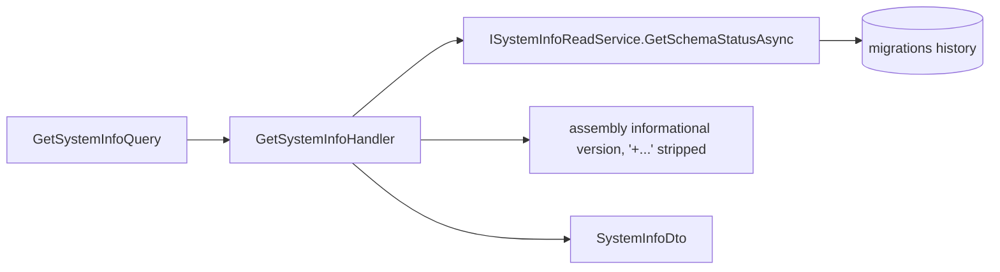

# src/TutoringCentre.Application/Platform/Queries/GetSystemInfo/GetSystemInfoHandler.cs

## Purpose

Builds `SystemInfoDto` from the read service and from the assembly's informational version.

## Where It Fits

Application/Platform/Queries/GetSystemInfo, `internal`. Resolved by `Dispatcher.QueryAsync`; depends on `ISystemInfoReadService`.

## Walkthrough

`HandleAsync` (18-): `await readService.GetSchemaStatusAsync(ct)`; new `SystemInfoDto(ReadApplicationVersion(), status.LatestAppliedMigration, DatabaseUpToDate: status.PendingMigrationCount == 0)`; returns `Result.Success`.
`ReadApplicationVersion` (30-): reads `AssemblyInformationalVersionAttribute` from the handler's assembly via reflection; null/blank -> `"unknown"`; otherwise cuts at the first `+` (line 41) because SourceLink appends `+<commit sha>` and the API should not leak build metadata.
No authorization check: documented as intentional (non-sensitive, anonymous). Attribute `[SuppressMessage CA1812]` because only DI instantiates it.

## Concepts Used

### CQRS and the dispatcher pipeline

#### What it means

CQRS separates *commands* (intent to change state) from *queries* (read-only questions). A *handler* executes exactly one command or query. A *dispatcher* is the single entry point that finds the handler and wraps shared steps (validation, transaction, logging) around it, so every use case behaves the same way regardless of who calls it (web endpoint, CLI, future bot).

(Full tutorial with execution traces: [PROJECT_OVERVIEW.md#63-cqrs-and-the-hand-written-dispatcher](../../../../../../PROJECT_OVERVIEW.md#63-cqrs-and-the-hand-written-dispatcher).)

#### Where it appears in this file

Query handler.

#### How it works here

Class.

#### Why it matters here

Runs inside a read-only transaction.

### Repository pattern and read services

#### What it means

A *repository* looks like a collection of aggregates (`Add`, `ExistsBy...`) and hides how they are stored. A *read service* is a separate query-side abstraction that returns DTOs directly, so reads need not load and map domain entities.

(Full tutorial with execution traces: [PROJECT_OVERVIEW.md#68-repository-pattern-and-read-services](../../../../../../PROJECT_OVERVIEW.md#68-repository-pattern-and-read-services).)

#### Where it appears in this file

Read-service dependency.

#### How it works here

Primary constructor.

#### Why it matters here

No EF in Application.

### Assembly scanning and reflection

#### What it means

*Reflection* lets code inspect types at runtime (`assembly.GetTypes()`, `type.GetInterfaces()`). *Assembly scanning* uses it to find classes implementing a given interface and register them automatically, so adding a new handler needs no registration line.

(Full tutorial with execution traces: [PROJECT_OVERVIEW.md#62-dependency-injection-lifetimes-and-scanning](../../../../../../PROJECT_OVERVIEW.md#62-dependency-injection-lifetimes-and-scanning).)

#### Where it appears in this file

Registration.

#### How it works here

No explicit registration anywhere.

#### Why it matters here

Found by `HandlerRegistration`.

## Data and Control Flow

## Configuration and Environment

None. The file reads no environment variables and declares no configuration keys, URLs, ports or credentials.

## Gotchas and Issues

Reflection on every call (cheap here). If the assembly has no informational version the API reports `unknown`.

## Related Files

- [`src/TutoringCentre.Application/Platform/ISystemInfoReadService.cs`](../../ISystemInfoReadService.cs.md)
- [`src/TutoringCentre.Application/Platform/SystemInfoDto.cs`](../../SystemInfoDto.cs.md)
- [`src/TutoringCentre.Application/Platform/Queries/GetSystemInfo/GetSystemInfoQuery.cs`](GetSystemInfoQuery.cs.md)
- [`tests/TutoringCentre.Application.Tests/Platform/GetSystemInfoHandlerTests.cs`](../../../../../tests/TutoringCentre.Application.Tests/Platform/GetSystemInfoHandlerTests.cs.md)
- [`src/TutoringCentre.Infrastructure/ReadServices/SystemInfoReadService.cs`](../../../../TutoringCentre.Infrastructure/ReadServices/SystemInfoReadService.cs.md)
