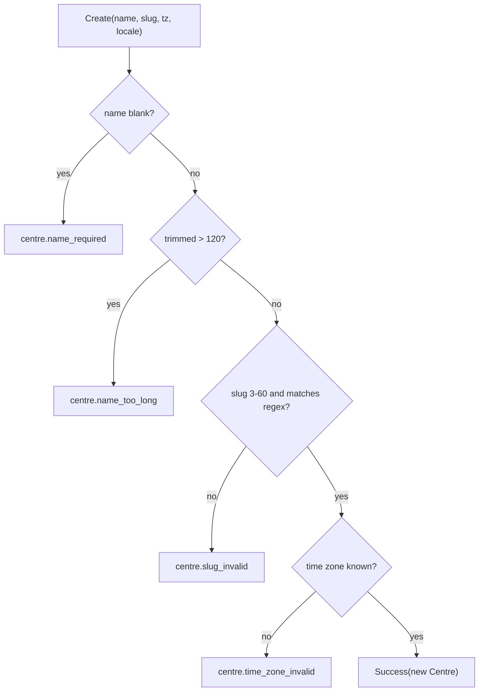

# src/TutoringCentre.Domain/Centres/Centre.cs

## Purpose

The only entity in the system: a tutoring centre (the tenant). It guarantees that a `Centre` object can only exist if it passed the business rules.

## Where It Fits

Domain/Centres. Built by `CreateCentreHandler`; read by `CentreRepository` (EF) and mapped by `CentreConfiguration`. Depends on `Entity`, `Result`, `Error`, `SupportedLocale`.

## Walkthrough

- Constants (9-11): `NameMaxLength = 120`, `SlugMinLength = 3`, `SlugMaxLength = 60` - reused by `CreateCentreValidator` and `CentreConfiguration` so limits cannot diverge.
- Private value constructor (13-20) and private parameterless constructor (22-27) 'for EF Core materialisation': strings set to `string.Empty` to satisfy nullable analysis; EF then overwrites every property.
- Properties `Name`, `Slug`, `TimeZoneId`, `DefaultLocale` all `{ get; private set; }`.
- `Create(...)` (38-69), returns `Result<Centre>`:
  1. blank name -> `centre.name_required` (42);
  2. trimmed name longer than 120 -> `centre.name_too_long`;
  3. slug null, <3, >60 or failing `SlugPattern()` -> `centre.slug_invalid`;
  4. blank time zone or `TimeZoneInfo.TryFindSystemTimeZoneById` false -> `centre.time_zone_invalid`;
  5. success with the **trimmed name**; the slug is *not* trimmed or lower-cased.
- `SlugPattern()` (72): `[GeneratedRegex(@"^[a-z0-9]+(?:-[a-z0-9]+)*\z")]` - lowercase letters/digits with single hyphens between words; `\z` rather than `$` so a trailing newline is rejected.
Edge cases: `-abc`, `abc--def`, `Bad Slug`, `ab` rejected (tests). The time-zone check depends on the host OS time-zone database. No method changes a centre after creation, so `UpdatedAt` is never stamped.

## Concepts Used

### Entities, encapsulation and factory methods

#### What it means

An *entity* has an identity that stays the same while its data changes. *Encapsulation* keeps its state behind rules (private setters, private constructors). A *factory method* is the only public way to build one, so an invalid instance cannot exist.

(Full tutorial with execution traces: [PROJECT_OVERVIEW.md#66-entities-encapsulation-and-factory-methods](../../../../PROJECT_OVERVIEW.md#66-entities-encapsulation-and-factory-methods).)

#### Where it appears in this file

The class.

#### How it works here

Private constructors + `public static Result<Centre> Create`.

#### Why it matters here

An invalid centre cannot be constructed anywhere (handler, tests, seed).

### Source-generated regular expressions

#### What it means

`[GeneratedRegex]` makes the compiler emit the matching code at build time (needs a `partial` method), avoiding runtime regex construction. `\z` anchors at the true end of input, unlike `$` which also matches before a trailing newline.

(Full tutorial with execution traces: [PROJECT_OVERVIEW.md#66-entities-encapsulation-and-factory-methods](../../../../PROJECT_OVERVIEW.md#66-entities-encapsulation-and-factory-methods).)

#### Where it appears in this file

`SlugPattern`.

#### How it works here

Lines 71-72 and the `partial` modifier on the class.

#### Why it matters here

Compiled at build time; `partial` is required by the generator.

### The Result pattern (failures as values)

#### What it means

Expected business failures (invalid input, duplicate, not allowed) are returned as ordinary values - a `Result` holding either a value or an `Error` - instead of thrown. Exceptions are reserved for bugs and infrastructure faults. The caller's code must look at the result, so the failure path cannot be forgotten, and no exception-handling cost or hidden control flow is involved.

(Full tutorial with execution traces: [PROJECT_OVERVIEW.md#64-the-result-pattern-failures-as-values](../../../../PROJECT_OVERVIEW.md#64-the-result-pattern-failures-as-values).)

#### Where it appears in this file

Return type of `Create`.

#### How it works here

Every failure path returns `Result<Centre>.Failure(Error.Validation(...))`.

#### Why it matters here

Handler can pass the error up without exceptions.

## Data and Control Flow

## Configuration and Environment

None. The file reads no environment variables and declares no configuration keys, URLs, ports or credentials.

## Gotchas and Issues

The failure message for the name limit hard-codes '120' instead of using the constant. Time-zone validity depends on the machine (ICU/tzdata). `CentreTests` has no test for the 60/61-character slug boundary (the validator test covers 61).

## Related Files

- [`src/TutoringCentre.Domain/Common/Entity.cs`](../Common/Entity.cs.md)
- [`src/TutoringCentre.Domain/Common/Result.cs`](../Common/Result.cs.md)
- [`src/TutoringCentre.Domain/Centres/SupportedLocale.cs`](SupportedLocale.cs.md)
- [`src/TutoringCentre.Application/Centres/Commands/CreateCentre/CreateCentreHandler.cs`](../../TutoringCentre.Application/Centres/Commands/CreateCentre/CreateCentreHandler.cs.md)
- [`src/TutoringCentre.Application/Centres/Commands/CreateCentre/CreateCentreValidator.cs`](../../TutoringCentre.Application/Centres/Commands/CreateCentre/CreateCentreValidator.cs.md)
- [`src/TutoringCentre.Infrastructure/Persistence/Configurations/Centres/CentreConfiguration.cs`](../../TutoringCentre.Infrastructure/Persistence/Configurations/Centres/CentreConfiguration.cs.md)
- [`tests/TutoringCentre.Domain.Tests/Centres/CentreTests.cs`](../../../tests/TutoringCentre.Domain.Tests/Centres/CentreTests.cs.md)
