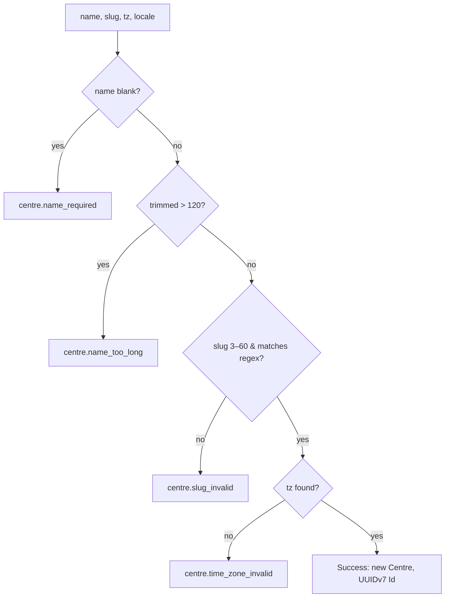

# src/TutoringCentre.Domain/Centres/Centre.cs

## Purpose
The `Centre` entity: a tutoring centre, which is **the tenant** of the multi-tenant system (line 6). It is the first real business entity. Its invariants (name, slug, time zone) are enforced by the only public way to create one, `Create`, which returns a `Result<Centre>` instead of throwing.

## Where it fits
Domain layer, `Centres` feature folder. It depends on `Entity`, `Result<T>` and `Error` (Domain/Common) and on `SupportedLocale`. It is used only by `tests/TutoringCentre.Domain.Tests/Centres/CentreTests.cs`. It is **not persisted yet**: there is no `IEntityTypeConfiguration` and no migration. The error codes it returns are translated in `frontend/src/api/errorMessages.ts:12-16,20-23`.

## Walkthrough
- **Line 7:** `public sealed partial class Centre : Entity`. `partial` is required by the source-generated regex (line 72). `sealed` means no subclassing.
- **Lines 9–11, constants:** `NameMaxLength = 120`, `SlugMinLength = 3`, `SlugMaxLength = 60`. They are public so later EF configurations and validators can reuse them.
- **Lines 13–19, private constructor:** sets all four properties. Only `Create` calls it.
- **Lines 21–27, private parameterless constructor:** for EF Core materialisation ("Days 8–9"). It sets the strings to `string.Empty` so nullable analysis is satisfied; EF then overwrites them from the row.
- **Lines 29–36, properties with private setters:**
  - `Name`, `Slug`;
  - `TimeZoneId` (doc: "IANA time zone identifier, e.g. "Africa/Cairo"");
  - `DefaultLocale`.
- **Lines 38–69, `Create(name, slug, timeZoneId, defaultLocale)`.** Checks run in order and the first failure returns:
  1. **Lines 40–43:** `string.IsNullOrWhiteSpace(name)` → `centre.name_required`.
  2. **Lines 45–50:** trim, then length > 120 → `centre.name_too_long`. The check is on the *trimmed* length.
  3. **Lines 52–60:** slug null, length < 3 or > 60, or not matching `SlugPattern()` → `centre.slug_invalid`. The slug is **not** trimmed or lower-cased; it must already be canonical.
  4. **Lines 62–66:** blank time zone, or `!TimeZoneInfo.TryFindSystemTimeZoneById(...)` → `centre.time_zone_invalid`.
  5. **Line 68:** success with the trimmed name.
- **Lines 71–73:** `[GeneratedRegex(@"^[a-z0-9]+(?:-[a-z0-9]+)*\z")] private static partial Regex SlugPattern();`
  - One or more lowercase letters or digits, then zero or more groups of a single hyphen plus letters or digits.
  - That rejects leading, trailing and double hyphens.
  - The comment explains `\z` rather than `$`: `$` would also accept a trailing `\n`.

## Concepts used
- **Always-valid entity / factory method:** the constructor is private, so an invalid `Centre` can never exist.
- **Result pattern:** expected validation failures are returned as values (`docs/architecture/overview.md:5`).
- **Source-generated regex** (`[GeneratedRegex]`): the regex is compiled at build time; no runtime parsing, AOT-friendly.
- **Encapsulation with private setters:** only the entity (and EF) can change state.

## Data and control flow

## Configuration and environment
None. The time-zone lookup depends on the OS/ICU time-zone database.

## Gotchas and issues
- **Windows time-zone ids are accepted.** On Linux, `Create(..., "Egypt Standard Time", ...)` succeeds (verified with a probe). .NET converts Windows ids to IANA during lookup, but the original string is stored. The doc comment promises IANA, so stored data can become inconsistent. Consider normalising with `TimeZoneInfo.TryConvertWindowsIdToIanaId`.
- The error message strings hard-code "120" and "3–60" instead of using the constants, so they could drift if the constants change.
- `SupportedLocale` is not validated with `Enum.IsDefined`, so a cast such as `(SupportedLocale)99` would be accepted.
- Only the *first* failing rule is reported. Field-level aggregation happens in the dispatcher's FluentValidation step, not here.

## Related files
- [Entity.cs](../Common/Entity.cs.md)
- [Result.cs](../Common/Result.cs.md)
- [Error.cs](../Common/Error.cs.md)
- [SupportedLocale.cs](SupportedLocale.cs.md)
- [CentreTests.cs](../../../tests/TutoringCentre.Domain.Tests/Centres/CentreTests.cs.md)
- [errorMessages.ts](../../../frontend/src/api/errorMessages.ts.md)
