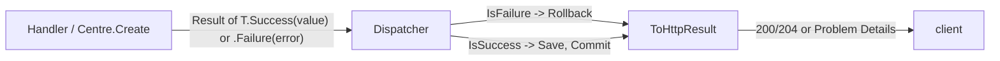

# src/TutoringCentre.Domain/Common/Result.cs

## Purpose

Defines `Result` and `Result<T>`, the return types for operations that can fail for expected business reasons.

## Where It Fits

Domain/Common. Used by `Centre.Create`, every `ICommandHandler`/`IQueryHandler`, `Dispatcher`, and `Api/Http/ResultHttpExtensions`. Depends on `Error`.

## Walkthrough

- `class Result` (line 6): protected constructor (lines 9-24) allows only two legal states - success with `error == null`, failure with an error; otherwise throws `ArgumentException` (line 13) or `ArgumentNullException` (line 18). Properties `IsSuccess`, `IsFailure => !IsSuccess` (27), `Error` (30). Factories `Success()` (32) and `Failure(Error)` (35).
- `sealed class Result<T> : Result` (43): private constructors so only the factories construct it; private `_value`. For a failure `_value = default!` (null-forgiving, because `Value` guards access).
- `Value` (61-64): returns `_value` when successful; **throws `InvalidOperationException`** when failed, with the error code in the message. Reading a failed value is treated as a bug, per the rules in `docs/architecture/overview.md`.
- `Success(T)` (66) and `public static new Failure(Error)` (69): `new` hides the base `Result.Failure` so `Result<T>.Failure(...)` returns a `Result<T>`.
- `[SuppressMessage CA1000]` justification: static members on a generic type are 'the agreed factory API'.
Called by: everywhere a use case ends. Edge cases: `Result.Failure(null!)` throws `ArgumentNullException` (tested). If the constructor guard were removed, a 'success with error' value could reach `ToHttpResult` and produce inconsistent HTTP output.

## Concepts Used

### The Result pattern (failures as values)

#### What it means

Expected business failures (invalid input, duplicate, not allowed) are returned as ordinary values - a `Result` holding either a value or an `Error` - instead of thrown. Exceptions are reserved for bugs and infrastructure faults. The caller's code must look at the result, so the failure path cannot be forgotten, and no exception-handling cost or hidden control flow is involved.

(Full tutorial with execution traces: [PROJECT_OVERVIEW.md#64-the-result-pattern-failures-as-values](../../../../PROJECT_OVERVIEW.md#64-the-result-pattern-failures-as-values).)

#### Where it appears in this file

Both classes.

#### How it works here

`Result<CreateCentreResult>.Failure(...)` in `CreateCentreHandler`; `result.IsFailure` checks in `Dispatcher.SendAsync` (line ~57); `result.Value` in `ResultHttpExtensions.ToHttpResult`.

#### Why it matters here

Makes expected failures explicit; the dispatcher can roll back on `IsFailure` without catching an exception.

### Generics and constraints

#### What it means

Generics let one definition work for many types (`Result<T>`, `ICommandHandler<TCommand,TResponse>`). Constraints (`where TCommand : ICommand<TResponse>`) restrict which types are legal so the compiler can check them; the `in` modifier (contravariance) lets a handler of a base type satisfy a derived one.

(Full tutorial with execution traces: [PROJECT_OVERVIEW.md#63-cqrs-and-the-hand-written-dispatcher](../../../../PROJECT_OVERVIEW.md#63-cqrs-and-the-hand-written-dispatcher).)

#### Where it appears in this file

`Result<T>` and the `static new` factory.

#### How it works here

`public static new Result<T> Failure(Error error) => new(error);`

#### Why it matters here

Return type matches the caller's generic type; the base-class `Failure` returns a non-generic `Result`.

## Data and Control Flow

## Configuration and Environment

None. The file reads no environment variables and declares no configuration keys, URLs, ports or credentials.

## Gotchas and Issues

Reading `.Value` before checking `IsSuccess` is the main trap; callers in this repo check first (`created.IsFailure` in the handler). `Error` is declared `Error?`, so callers use `!` after proving failure (`created.Error!`).

## Related Files

- [`src/TutoringCentre.Domain/Common/Error.cs`](Error.cs.md)
- [`src/TutoringCentre.Domain/Common/ErrorKind.cs`](ErrorKind.cs.md)
- [`src/TutoringCentre.Domain/Centres/Centre.cs`](../Centres/Centre.cs.md)
- [`src/TutoringCentre.Application/Common/Cqrs/Dispatcher.cs`](../../TutoringCentre.Application/Common/Cqrs/Dispatcher.cs.md)
- [`src/TutoringCentre.Api/Http/ResultHttpExtensions.cs`](../../TutoringCentre.Api/Http/ResultHttpExtensions.cs.md)
- [`tests/TutoringCentre.Domain.Tests/Common/ResultTests.cs`](../../../tests/TutoringCentre.Domain.Tests/Common/ResultTests.cs.md)
