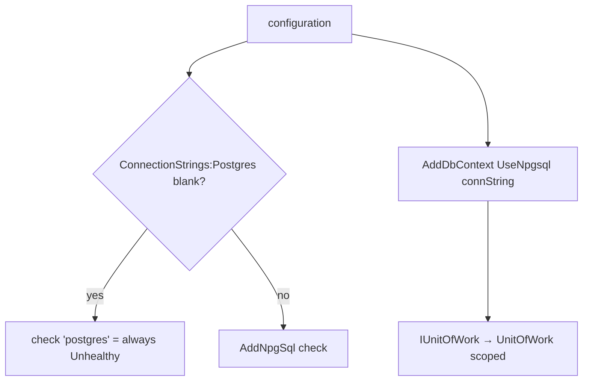

# src/TutoringCentre.Infrastructure/DependencyInjection.cs

## Purpose
`AddInfrastructure(services, configuration)` registers Infrastructure's implementations of Application ports (line 12):
- the clock;
- the PostgreSQL readiness health check, which degrades gracefully when unconfigured;
- the EF Core `AppDbContext` with its conventions and interceptor;
- the unit of work.

## Where it fits
Infrastructure layer. Called once from `src/TutoringCentre.Api/Program.cs:16`. It depends on `SystemClock`, `TimestampInterceptor`, `AppDbContext`, `Schemas`, `UnitOfWork`, EF Core/Npgsql and the HealthChecks.NpgSql package.

## Walkthrough
- **Lines 15–16:** constants: connection-string name `"Postgres"` and health-check name `"postgres"`.
- **Line 19:** `private static readonly string[] ReadinessTags = ["ready"];`. The comment: a static array avoids a per-call allocation (analyzer CA1861).
- **Lines 23–24:** null guards.
- **Lines 27–28:** `AddSingleton(TimeProvider.System)` and `AddSingleton<IClock, SystemClock>()`, both stateless and thread-safe.
- **Line 30:** `configuration.GetConnectionString("Postgres")` (reads `ConnectionStrings:Postgres`).
- **Line 31:** `services.AddHealthChecks()` returns the builder. Calling it again after `Program.cs:15` is idempotent.
- **Lines 33–44:**
  - If the string is null or whitespace: `AddCheck("postgres", () => HealthCheckResult.Unhealthy("ConnectionStrings:Postgres is not configured."), ["ready"])`. The comment says missing configuration must not crash startup.
  - Otherwise: `AddNpgSql(connectionString, name: "postgres", tags: ["ready"])`, which opens a connection to check the DB.
- **Line 47:** `AddSingleton<TimestampInterceptor>()`. It is stateless and depends only on the singleton clock.
- **Lines 48–53, `AddDbContext<AppDbContext>((sp, options) => ...)`:**
  - `UseNpgsql(connectionString, npgsql => npgsql.MigrationsHistoryTable("__ef_migrations_history", Schemas.Platform))` puts the EF migrations table in the `platform` schema.
  - `UseSnakeCaseNamingConvention()` makes tables and columns snake_case.
  - `AddInterceptors(sp.GetRequiredService<TimestampInterceptor>())`.
- **Line 56:** `AddScoped<IUnitOfWork, UnitOfWork>()`, one per scope.

## Concepts used
- **Composition per layer:** the Api only calls `AddInfrastructure`.
- **Dependency Inversion:** Application defines `IClock`/`IUnitOfWork`; this file binds them.
- **Graceful degradation:** unconfigured DB → readiness 503, not a crash.
- **DbContext pooling?** No: plain `AddDbContext`, so the context is scoped by default (EF behaviour).
- **Health-check tags:** used by `Program.cs` to select the readiness checks.

## Data and control flow

## Configuration and environment
| Key | Effect |
| --- | --- |
| `ConnectionStrings:Postgres` | Npgsql connection string for both the health check and EF Core |

## Gotchas and issues
- **A blank connection string still configures EF.** `UseNpgsql(null)` is accepted, and DI resolves `AppDbContext`, `UnitOfWork` and `Dispatcher` fine. The first database operation then throws `InvalidOperationException: The ConnectionString property has not been initialized` (verified with a probe). Fine while no endpoint uses the DB; once endpoints exist, consider startup validation for non-health paths.
- **EF warns on every context use.** Each time a context model is built, EF logs warning 10632 "No instantiatable types implementing IEntityTypeConfiguration were found" (verified), because there are no entity configurations yet.
- `Schemas.Platform` is used for the history table, but no tables exist yet.

## Related files
- [Program.cs](../TutoringCentre.Api/Program.cs.md)
- [AppDbContext.cs](Persistence/AppDbContext.cs.md)
- [UnitOfWork.cs](Persistence/UnitOfWork.cs.md)
- [TimestampInterceptor.cs](Persistence/Interceptors/TimestampInterceptor.cs.md)
- [SystemClock.cs](Time/SystemClock.cs.md)
- [HealthEndpointTests.cs](../../tests/TutoringCentre.Api.Tests/Health/HealthEndpointTests.cs.md)
