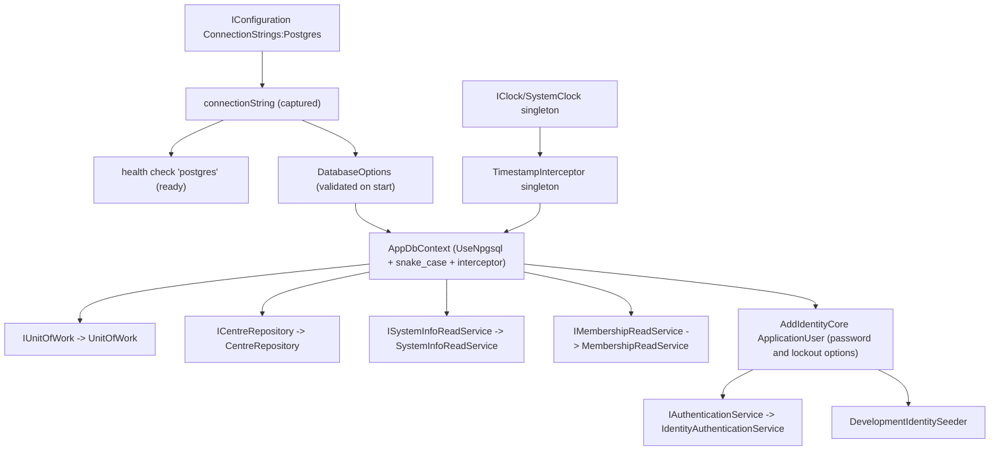

# src/TutoringCentre.Infrastructure/DependencyInjection.cs

## Purpose

Infrastructure's registration entry point: wires every Application port to its PostgreSQL/EF/system implementation, configures the database, health check and options, and registers ASP.NET Core Identity (core only) with the password and lockout policy.

## Where It Fits

Infrastructure root. Called by `Program.cs:45` and `PostgresFixture`. Depends on `AppDbContext`, `UnitOfWork`, `CentreRepository`, `SystemInfoReadService`, `MembershipReadService`, `SystemClock`, `TimestampInterceptor`, `DatabaseOptions`, `Schemas`, `ApplicationUser`, `IdentityAuthenticationService`, `DevelopmentIdentitySeeder`; registers ports declared in Application.

## Walkthrough

`AddInfrastructure(this IServiceCollection, IConfiguration)` (30-106), in order:
1. `AddSingleton(configuration)` (38) - new. Comment: the host already registers it, but registering it here lets services that read `IConfiguration` directly (the seeder's `Seed:Password`) resolve in test harnesses that build a plain `ServiceCollection`.
2. `AddSingleton(TimeProvider.System)` and `AddSingleton<IClock, SystemClock>()` (41-42).
3. `connectionString = configuration.GetConnectionString("Postgres")` (44).
4. `AddHealthChecks()` then (47-58): blank string -> `AddCheck("postgres", () => Unhealthy("ConnectionStrings:Postgres is not configured."), ReadinessTags)`; else `AddNpgSql(connectionString, name: "postgres", tags: ReadinessTags)`.
5. `AddSingleton<TimestampInterceptor>()` (61).
6. Options (63-67): `AddOptions<DatabaseOptions>().Configure(...).ValidateDataAnnotations().ValidateOnStart()`.
7. `AddDbContext<AppDbContext>` (69-74): `UseNpgsql(..., npgsql => npgsql.MigrationsHistoryTable("__ef_migrations_history", Schemas.Platform))`, `UseSnakeCaseNamingConvention()`, `AddInterceptors(TimestampInterceptor)`.
8. Scoped ports (77-82): `IUnitOfWork -> UnitOfWork`, `ICentreRepository -> CentreRepository`, `ISystemInfoReadService -> SystemInfoReadService`, `IMembershipReadService -> MembershipReadService`.
9. **Identity** (84-103): `AddIdentityCore<ApplicationUser>(options => ...)` - the comment says: Identity *core only*: no `SignInManager`, no Identity UI, no role services (no role tables - a role belongs to a user in a centre). Options: `Password.RequiredLength = 10`, `RequireDigit/Uppercase/Lowercase/NonAlphanumeric = false` ('modern guidance favours password length over composition rules'); `Lockout.MaxFailedAccessAttempts = 5`, `Lockout.DefaultLockoutTimeSpan = 15 minutes`, `Lockout.AllowedForNewUsers = true`; `User.RequireUniqueEmail = true`. `.AddEntityFrameworkStores<AppDbContext>()`. Then `AddScoped<DevelopmentIdentitySeeder>()` and `AddScoped<IAuthenticationService, IdentityAuthenticationService>()`.
Important detail: the connection string is captured when this method runs; test hosts pass it with `UseSetting`. Because of `ValidateOnStart`, an empty string stops the host at start; the 'not configured' health-check branch is then unreachable in a normally started app.

## Concepts Used

### Dependency Injection (DI) and the container

#### What it means

A class that needs a collaborator can create it itself (`new X()`), which hard-wires the choice, or it can *receive* it, usually as a constructor parameter. That second approach is dependency injection. A DI *container* stores *registrations* ("when asked for type A, build type B with lifetime L") and performs *resolution*: it picks a constructor, resolves each parameter recursively, builds the object and caches it according to the lifetime. This is inversion of control: the class no longer decides what it depends on.

(Full tutorial with execution traces: [PROJECT_OVERVIEW2.md#62-dependency-injection-lifetimes-and-scanning](../../../PROJECT_OVERVIEW2.md#62-dependency-injection-lifetimes-and-scanning).)

#### Where it appears in this file

Registering ports, Identity and options.

#### How it works here

Lines 38-103.

#### Why it matters here

One method lists every adapter the application needs.

### Service lifetimes (singleton, scoped, transient)

#### What it means

Lifetime says how long a container-built instance lives. *Singleton*: one for the whole application. *Scoped*: one per scope; in ASP.NET one scope = one HTTP request, and code can create its own scope (as the seed command does). *Transient*: a new instance on every resolution. A longer-lived service must not hold a shorter-lived one (a "captive dependency"), which `ValidateScopes` detects.

(Full tutorial with execution traces: [PROJECT_OVERVIEW2.md#62-dependency-injection-lifetimes-and-scanning](../../../PROJECT_OVERVIEW2.md#62-dependency-injection-lifetimes-and-scanning).)

#### Where it appears in this file

Scoped adapters, singleton interceptor and clock.

#### How it works here

Lines 41-42, 61, 77-82, 102-103.

#### Why it matters here

DbContext-bound services are scoped; stateless helpers are singletons.

### Options pattern and ValidateOnStart

#### What it means

The options pattern binds configuration into a typed class and can validate it. `ValidateOnStart` runs that validation when the host starts, so a bad configuration stops the app immediately instead of failing on first use.

(Full tutorial with execution traces: [PROJECT_OVERVIEW2.md#614-options-validation-and-health-checks](../../../PROJECT_OVERVIEW2.md#614-options-validation-and-health-checks).)

#### Where it appears in this file

Validated options and Identity options.

#### How it works here

Lines 63-67 and 86-100.

#### Why it matters here

Misconfiguration fails at startup; Identity's password and lockout rules are options, not code.

### Health checks: liveness vs readiness

#### What it means

*Liveness* answers "is the process alive?"; *readiness* answers "can it serve traffic (dependencies up)?". Orchestrators restart on liveness failure and stop routing on readiness failure, so the two must not be conflated.

(Full tutorial with execution traces: [PROJECT_OVERVIEW2.md#614-options-validation-and-health-checks](../../../PROJECT_OVERVIEW2.md#614-options-validation-and-health-checks).)

#### Where it appears in this file

Readiness check.

#### How it works here

Lines 47-58.

#### Why it matters here

Tagged `ready` so `/health/ready` reports database reachability.

### ORM and EF Core

#### What it means

An ORM maps database rows to objects. EF Core keeps a *change tracker* that records the state of each entity (`Added`, `Unchanged`, `Modified`, `Deleted`); `SaveChanges` turns those states into `INSERT/UPDATE/DELETE`. LINQ expressions are translated to SQL by the provider and executed when awaited or enumerated (deferred execution). Mapping is declared in *model configuration*.

(Full tutorial with execution traces: [PROJECT_OVERVIEW2.md#69-ef-core-how-the-orm-actually-works-here](../../../PROJECT_OVERVIEW2.md#69-ef-core-how-the-orm-actually-works-here).)

#### Where it appears in this file

`AddDbContext` and Identity stores.

#### How it works here

Lines 69-74 and 101.

#### Why it matters here

`AddEntityFrameworkStores<AppDbContext>` connects `UserManager` to the same context and transaction machinery.

### Dependency inversion, ports and adapters

#### What it means

A *dependency* is something a piece of code needs in order to work. Normally high-level business code ends up depending on low-level details (database, HTTP). **Dependency inversion** reverses that: the business layer declares an interface (a *port*) describing what it needs, and the low-level layer supplies a class implementing it (an *adapter*). The compiler-level arrow then points from detail to policy, so business code can be tested and reused without the detail.

(Full tutorial with execution traces: [PROJECT_OVERVIEW2.md#61-clean-architecture-dependency-inversion-and-the-composition-root](../../../PROJECT_OVERVIEW2.md#61-clean-architecture-dependency-inversion-and-the-composition-root).)

#### Where it appears in this file

Adapters registered against Application interfaces.

#### How it works here

Lines 77-82, 103.

#### Why it matters here

`IAuthenticationService` and `IMembershipReadService` are Application-owned; this file chooses the implementations.

### Identity and membership modelling

#### What it means

*Identity* is the part of a system that stores users, credentials and lockout state. *Membership* models which user may act in which centre in which role. Keeping role on the membership (not on the user) lets one person be an owner in one centre and a teacher in another.

(Full tutorial with execution traces: [PROJECT_OVERVIEW2.md#628-identity-and-membership-modelling](../../../PROJECT_OVERVIEW2.md#628-identity-and-membership-modelling).)

#### Where it appears in this file

Identity core configuration.

#### How it works here

Lines 84-103.

#### Why it matters here

Defines what 'a valid password' and 'locked out' mean for the whole system.

### Rate limiting, lockout and enumeration resistance

#### What it means

*Rate limiting* caps how many requests one source may make in a time window (stops password spraying from one place). *Lockout* temporarily blocks one account after repeated failures (stops many guesses against one account). *Enumeration resistance* means failure responses (and their timing) reveal nothing about whether an account exists.

(Full tutorial with execution traces: [PROJECT_OVERVIEW2.md#626-rate-limiting-lockout-and-enumeration-resistance](../../../PROJECT_OVERVIEW2.md#626-rate-limiting-lockout-and-enumeration-resistance).)

#### Where it appears in this file

Lockout parameters.

#### How it works here

Lines 95-97.

#### Why it matters here

Per-account protection that complements the per-IP login rate limiter.

## Data and Control Flow

## Configuration and Environment

Reads `ConnectionStrings:Postgres` (appsettings default empty; supplied by user-secrets or env var `ConnectionStrings__Postgres`). Names: health check `postgres`, tag `ready`, history table `platform.__ef_migrations_history`. Identity policy values: password minimum length 10, lockout after 5 failures for 15 minutes, unique email required.

## Gotchas and Issues

`AddHealthChecks()` is called here and also in `Program.cs`; both calls return the same builder state, harmless. The comment 'Missing configuration must not crash startup; readiness reports it instead' is contradicted by `ValidateOnStart` in the same method. The comment on the Identity block says cookie/sign-in wiring is 'Day 15' - it lives in the Api project (`AuthenticationSetup`), not here.

## Related Files

- [`src/TutoringCentre.Infrastructure/Persistence/AppDbContext.cs`](Persistence/AppDbContext.cs.md)
- [`src/TutoringCentre.Infrastructure/Persistence/UnitOfWork.cs`](Persistence/UnitOfWork.cs.md)
- [`src/TutoringCentre.Infrastructure/Persistence/DatabaseOptions.cs`](Persistence/DatabaseOptions.cs.md)
- [`src/TutoringCentre.Infrastructure/Repositories/CentreRepository.cs`](Repositories/CentreRepository.cs.md)
- [`src/TutoringCentre.Infrastructure/ReadServices/SystemInfoReadService.cs`](ReadServices/SystemInfoReadService.cs.md)
- [`src/TutoringCentre.Infrastructure/ReadServices/MembershipReadService.cs`](ReadServices/MembershipReadService.cs.md)
- [`src/TutoringCentre.Infrastructure/Identity/ApplicationUser.cs`](Identity/ApplicationUser.cs.md)
- [`src/TutoringCentre.Infrastructure/Identity/IdentityAuthenticationService.cs`](Identity/IdentityAuthenticationService.cs.md)
- [`src/TutoringCentre.Infrastructure/Identity/DevelopmentIdentitySeeder.cs`](Identity/DevelopmentIdentitySeeder.cs.md)
- [`src/TutoringCentre.Infrastructure/Time/SystemClock.cs`](Time/SystemClock.cs.md)
- [`src/TutoringCentre.Infrastructure/Persistence/Interceptors/TimestampInterceptor.cs`](Persistence/Interceptors/TimestampInterceptor.cs.md)
- [`src/TutoringCentre.Api/Program.cs`](../TutoringCentre.Api/Program.cs.md)
