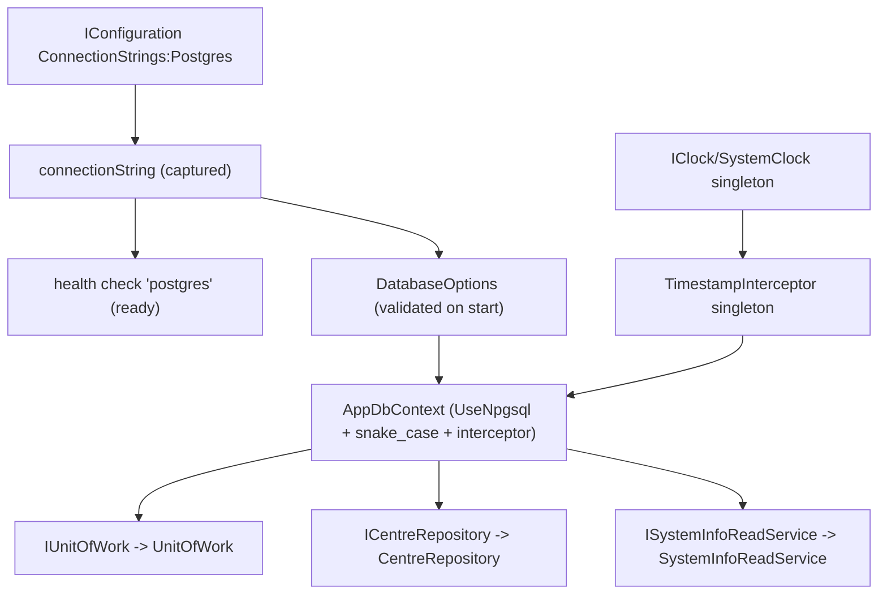

# src/TutoringCentre.Infrastructure/DependencyInjection.cs

## Purpose

Infrastructure's registration entry point: wires every Application port to its PostgreSQL/EF/system implementation and configures the database, health check and options.

## Where It Fits

Infrastructure root. Called by `Program.cs:31` and `PostgresFixture`. Depends on `AppDbContext`, `UnitOfWork`, `CentreRepository`, `SystemInfoReadService`, `SystemClock`, `TimestampInterceptor`, `DatabaseOptions`, `Schemas`; registers ports declared in Application.

## Walkthrough

`AddInfrastructure(this IServiceCollection, IConfiguration)` (26-75), in order:
1. `AddSingleton(TimeProvider.System)` and `AddSingleton<IClock, SystemClock>()` (32-33) - stateless and thread-safe.
2. `connectionString = configuration.GetConnectionString("Postgres")` (35) reads key `ConnectionStrings:Postgres`.
3. `AddHealthChecks()` then (38-49): blank string -> `AddCheck("postgres", () => Unhealthy("ConnectionStrings:Postgres is not configured."), ReadinessTags)`; else `AddNpgSql(connectionString, name: "postgres", tags: ReadinessTags)`. `ReadinessTags` (24) is a `static readonly string[]` (analyzer CA1861).
4. `AddSingleton<TimestampInterceptor>()` (52).
5. Options (54-58): `AddOptions<DatabaseOptions>().Configure(o => o.ConnectionString = connectionString ?? "").ValidateDataAnnotations().ValidateOnStart()`.
6. `AddDbContext<AppDbContext>((sp, options) => ...)` (60-65): `UseNpgsql(sp.GetRequiredService<IOptions<DatabaseOptions>>().Value.ConnectionString, npgsql => npgsql.MigrationsHistoryTable("__ef_migrations_history", Schemas.Platform))`, `UseSnakeCaseNamingConvention()`, `AddInterceptors(sp.GetRequiredService<TimestampInterceptor>())`.
7. Scoped: `IUnitOfWork -> UnitOfWork` (68), `ICentreRepository -> CentreRepository` (70), `ISystemInfoReadService -> SystemInfoReadService` (72).
Important detail: the connection string is captured when this method runs, from whatever configuration exists then. Test hosts therefore pass it with `UseSetting` so it is visible before build.
Because of `ValidateOnStart`, an empty string stops the host at start; the 'not configured' health-check branch (38-45) is then unreachable in a normally started app.

## Concepts Used

### Dependency Injection (DI) and the container

#### What it means

A class that needs a collaborator can create it itself (`new X()`), which hard-wires the choice, or it can *receive* it, usually as a constructor parameter. That second approach is dependency injection. A DI *container* stores *registrations* ("when asked for type A, build type B with lifetime L") and performs *resolution*: it picks a constructor, resolves each parameter recursively, builds the object and caches it according to the lifetime. This is inversion of control: the class no longer decides what it depends on.

(Full tutorial with execution traces: [PROJECT_OVERVIEW.md#62-dependency-injection-lifetimes-and-scanning](../../../PROJECT_OVERVIEW.md#62-dependency-injection-lifetimes-and-scanning).)

#### Where it appears in this file

All registrations.

#### How it works here

Lines 32-72.

#### Why it matters here

The one place that chooses adapters.

### Service lifetimes (singleton, scoped, transient)

#### What it means

Lifetime says how long a container-built instance lives. *Singleton*: one for the whole application. *Scoped*: one per scope; in ASP.NET one scope = one HTTP request, and code can create its own scope (as the seed command does). *Transient*: a new instance on every resolution. A longer-lived service must not hold a shorter-lived one (a "captive dependency"), which `ValidateScopes` detects.

(Full tutorial with execution traces: [PROJECT_OVERVIEW.md#62-dependency-injection-lifetimes-and-scanning](../../../PROJECT_OVERVIEW.md#62-dependency-injection-lifetimes-and-scanning).)

#### Where it appears in this file

Singleton clock/interceptor, scoped DbContext/UoW/repos.

#### How it works here

Lines 32-33, 52, 60, 68-72.

#### Why it matters here

Singletons hold no per-request state; scoped items share one `AppDbContext` per scope.

### Options pattern and ValidateOnStart

#### What it means

The options pattern binds configuration into a typed class and can validate it. `ValidateOnStart` runs that validation when the host starts, so a bad configuration stops the app immediately instead of failing on first use.

(Full tutorial with execution traces: [PROJECT_OVERVIEW.md#614-options-validation-and-health-checks](../../../PROJECT_OVERVIEW.md#614-options-validation-and-health-checks).)

#### Where it appears in this file

`DatabaseOptions` validation.

#### How it works here

Lines 54-58.

#### Why it matters here

Fail fast on missing configuration.

### Health checks: liveness vs readiness

#### What it means

*Liveness* answers "is the process alive?"; *readiness* answers "can it serve traffic (dependencies up)?". Orchestrators restart on liveness failure and stop routing on readiness failure, so the two must not be conflated.

(Full tutorial with execution traces: [PROJECT_OVERVIEW.md#614-options-validation-and-health-checks](../../../PROJECT_OVERVIEW.md#614-options-validation-and-health-checks).)

#### Where it appears in this file

Readiness check registration.

#### How it works here

Lines 36-49.

#### Why it matters here

`/health/ready` runs checks tagged `ready`.

### ORM and EF Core

#### What it means

An ORM maps database rows to objects. EF Core keeps a *change tracker* that records the state of each entity (`Added`, `Unchanged`, `Modified`, `Deleted`); `SaveChanges` turns those states into `INSERT/UPDATE/DELETE`. LINQ expressions are translated to SQL by the provider and executed when awaited or enumerated (deferred execution). Mapping is declared in *model configuration*.

(Full tutorial with execution traces: [PROJECT_OVERVIEW.md#69-ef-core-how-the-orm-actually-works-here](../../../PROJECT_OVERVIEW.md#69-ef-core-how-the-orm-actually-works-here).)

#### Where it appears in this file

`AddDbContext` configuration.

#### How it works here

Lines 60-65.

#### Why it matters here

Provider, naming convention, interceptor and history-table location.

### Dependency inversion, ports and adapters

#### What it means

A *dependency* is something a piece of code needs in order to work. Normally high-level business code ends up depending on low-level details (database, HTTP). **Dependency inversion** reverses that: the business layer declares an interface (a *port*) describing what it needs, and the low-level layer supplies a class implementing it (an *adapter*). The compiler-level arrow then points from detail to policy, so business code can be tested and reused without the detail.

(Full tutorial with execution traces: [PROJECT_OVERVIEW.md#61-clean-architecture-dependency-inversion-and-the-composition-root](../../../PROJECT_OVERVIEW.md#61-clean-architecture-dependency-inversion-and-the-composition-root).)

#### Where it appears in this file

Adapters registered for Application ports.

#### How it works here

Lines 68-72.

#### Why it matters here

Application never references these classes.

## Data and Control Flow

## Configuration and Environment

Reads `ConnectionStrings:Postgres` (appsettings default empty; supplied by user-secrets or env var `ConnectionStrings__Postgres`). Names: health check `postgres`, tag `ready`, history table `platform.__ef_migrations_history`.

## Gotchas and Issues

`AddHealthChecks()` is called here and also in `Program.cs`; both calls return the same builder state, harmless. Comment 'Missing configuration must not crash startup; readiness reports it instead' is contradicted by `ValidateOnStart` in the same method.

## Related Files

- [`src/TutoringCentre.Infrastructure/Persistence/AppDbContext.cs`](Persistence/AppDbContext.cs.md)
- [`src/TutoringCentre.Infrastructure/Persistence/UnitOfWork.cs`](Persistence/UnitOfWork.cs.md)
- [`src/TutoringCentre.Infrastructure/Persistence/DatabaseOptions.cs`](Persistence/DatabaseOptions.cs.md)
- [`src/TutoringCentre.Infrastructure/Repositories/CentreRepository.cs`](Repositories/CentreRepository.cs.md)
- [`src/TutoringCentre.Infrastructure/ReadServices/SystemInfoReadService.cs`](ReadServices/SystemInfoReadService.cs.md)
- [`src/TutoringCentre.Infrastructure/Time/SystemClock.cs`](Time/SystemClock.cs.md)
- [`src/TutoringCentre.Infrastructure/Persistence/Interceptors/TimestampInterceptor.cs`](Persistence/Interceptors/TimestampInterceptor.cs.md)
- [`src/TutoringCentre.Api/Program.cs`](../TutoringCentre.Api/Program.cs.md)
