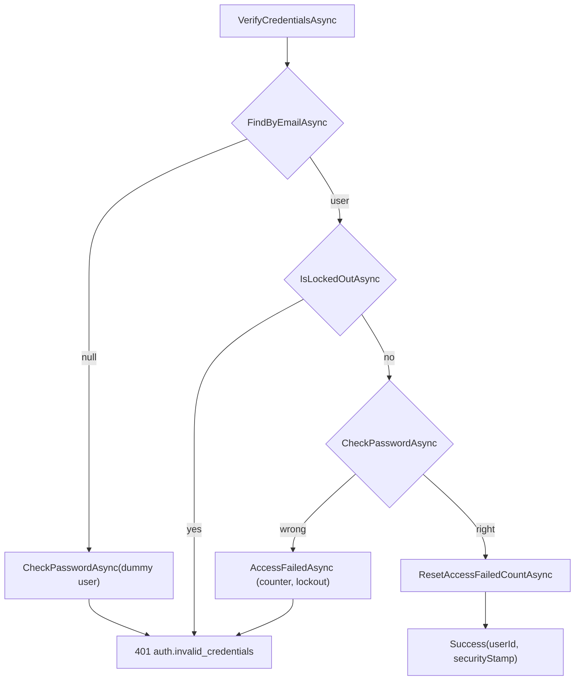

# src/TutoringCentre.Infrastructure/Identity/IdentityAuthenticationService.cs

## Purpose

Implements `IAuthenticationService` with ASP.NET Core Identity's `UserManager`: password check, lockout, no account enumeration.

## Where It Fits

Infrastructure/Identity, `internal partial`. Registered scoped in `AddInfrastructure`; called by `AuthEndpoints.LoginAsync`. Depends on `UserManager<ApplicationUser>`.

## Walkthrough

`VerifyCredentialsAsync` (23-48):
1. `FindByEmailAsync(email)`; unknown -> `CheckPasswordAsync(DummyUser, password)` (30) to pay the same hashing cost (timing), then `InvalidCredentials()`.
2. `IsLockedOutAsync(user)` -> log `Login attempt for locked-out user {UserId}` (id only, never email) and return the identical failure.
3. `CheckPasswordAsync(user, password)` false -> `AccessFailedAsync(user)` (increments the failed counter; locks the user at the configured threshold) and failure.
4. Success -> `ResetAccessFailedCountAsync(user)`; `AuthenticatedUser(user.Id, user.SecurityStamp ?? "")`.
`InvalidCredentials()` always returns `Error.Unauthenticated("auth.invalid_credentials", "Incorrect email or password.")`. `DummyUser` is a static user with a real hash of a constant password (53-58), built once.
Doc: `UserManager` saves its own counters through the Identity store as it goes - 'the one intentional write path outside the dispatcher'.

## Concepts Used

### Rate limiting, lockout and enumeration resistance

#### What it means

*Rate limiting* caps how many requests one source may make in a time window (stops password spraying from one place). *Lockout* temporarily blocks one account after repeated failures (stops many guesses against one account). *Enumeration resistance* means failure responses (and their timing) reveal nothing about whether an account exists.

(Full tutorial with execution traces: [PROJECT_OVERVIEW2.md#626-rate-limiting-lockout-and-enumeration-resistance](../../../../PROJECT_OVERVIEW2.md#626-rate-limiting-lockout-and-enumeration-resistance).)

#### Where it appears in this file

Lockout and timing-safe failure.

#### How it works here

Lines 25-47.

#### Why it matters here

Wrong password, unknown email and locked account all produce the same 401 and similar cost.

### Identity and membership modelling

#### What it means

*Identity* is the part of a system that stores users, credentials and lockout state. *Membership* models which user may act in which centre in which role. Keeping role on the membership (not on the user) lets one person be an owner in one centre and a teacher in another.

(Full tutorial with execution traces: [PROJECT_OVERVIEW2.md#628-identity-and-membership-modelling](../../../../PROJECT_OVERVIEW2.md#628-identity-and-membership-modelling).)

#### Where it appears in this file

`UserManager`.

#### How it works here

Constructor.

#### Why it matters here

Verified credentials without `SignInManager`/Identity UI (ADR 0005).

### Structured logging, Serilog and correlation IDs

#### What it means

Structured logging records a message *template* plus named properties, so logs are queryable by field. A *correlation ID* is attached to every log line and response of one request so they can be matched. *Destructuring* lets Serilog log an object's properties; a policy can mask sensitive ones.

(Full tutorial with execution traces: [PROJECT_OVERVIEW2.md#613-structured-logging-correlation-ids-and-redaction](../../../../PROJECT_OVERVIEW2.md#613-structured-logging-correlation-ids-and-redaction).)

#### Where it appears in this file

`[LoggerMessage]` and no email in logs.

#### How it works here

Lines 60-61.

#### Why it matters here

`IdentityAuthenticationServiceTests` asserts no email appears in logs.

## Data and Control Flow

## Configuration and Environment

Lockout and password policy come from options set in `AddInfrastructure` (5 attempts, 15 minutes; min length 10).

## Gotchas and Issues

Lockout checks happen before the password check, so a locked account cannot be unlocked by guessing; but an attacker cannot tell lockout from a wrong password by the response. The dummy hash only equalises *hash cost*, not every database round trip (not verified to be perfectly constant-time).

## Related Files

- [`src/TutoringCentre.Application/Common/Security/IAuthenticationService.cs`](../../TutoringCentre.Application/Common/Security/IAuthenticationService.cs.md)
- [`src/TutoringCentre.Infrastructure/Identity/ApplicationUser.cs`](ApplicationUser.cs.md)
- [`src/TutoringCentre.Infrastructure/DependencyInjection.cs`](../DependencyInjection.cs.md)
- [`tests/TutoringCentre.Infrastructure.Tests/Identity/IdentityAuthenticationServiceTests.cs`](../../../tests/TutoringCentre.Infrastructure.Tests/Identity/IdentityAuthenticationServiceTests.cs.md)
