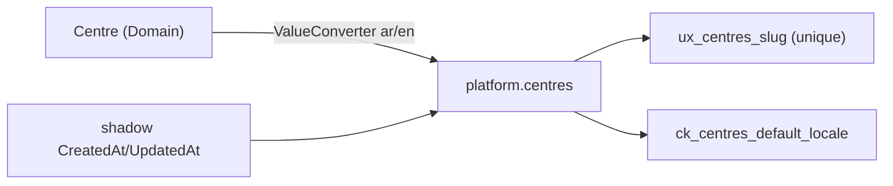

# src/TutoringCentre.Infrastructure/Persistence/Configurations/Centres/CentreConfiguration.cs

## Purpose

Maps the `Centre` entity to the `platform.centres` table: columns, limits, key, unique index, locale conversion, CHECK constraint and timestamp shadow properties.

## Where It Fits

Infrastructure/Persistence/Configurations, `internal`. Discovered by `AppDbContext.OnModelCreating`. Reads domain constants `Centre.NameMaxLength`, `Centre.SlugMaxLength`. Output is mirrored by `Migrations/20261002222404_InitialPlatform.cs`.

## Walkthrough

`Configure(EntityTypeBuilder<Centre>)`:
- `ToTable("centres", Schemas.Platform, table => table.HasCheckConstraint("ck_centres_default_locale", "default_locale IN ('ar','en')"))` (19-22) - schema `platform`; the database repeats the locale rule ('defence against rows written outside the app').
- `HasKey(Id)` and `Property(Id).ValueGeneratedNever()` (24-25) - domain assigns UUIDv7.
- `Name`: required, max 120 (27); `Slug`: required, max 60 (29) plus `HasIndex(Slug).IsUnique().HasDatabaseName("ux_centres_slug")` (30); `TimeZoneId`: required, max 64 (32).
- `DefaultLocale` (34-40): `HasConversion(new ValueConverter<SupportedLocale,string>(to, from))` + required + max length 2. Converters (47-61) are `switch` expressions mapping `Ar<->"ar"`, `En<->"en"` and throwing `ArgumentOutOfRangeException` for anything else.
- `Property<DateTimeOffset>("CreatedAt").IsRequired()` and `Property<DateTimeOffset?>("UpdatedAt")` (43-44) - **shadow properties** populated by `TimestampInterceptor`.
Column names come from the snake_case convention (`default_locale`, `time_zone_id`, `created_at`).

## Concepts Used

### ORM and EF Core

#### What it means

An ORM maps database rows to objects. EF Core keeps a *change tracker* that records the state of each entity (`Added`, `Unchanged`, `Modified`, `Deleted`); `SaveChanges` turns those states into `INSERT/UPDATE/DELETE`. LINQ expressions are translated to SQL by the provider and executed when awaited or enumerated (deferred execution). Mapping is declared in *model configuration*.

(Full tutorial with execution traces: [PROJECT_OVERVIEW2.md#69-ef-core-how-the-orm-actually-works-here](../../../../../../PROJECT_OVERVIEW2.md#69-ef-core-how-the-orm-actually-works-here).)

#### Where it appears in this file

Fluent entity mapping.

#### How it works here

Whole `Configure` method.

#### Why it matters here

Persistence concerns stay out of Domain.

### EF interceptors and shadow properties

#### What it means

An *interceptor* hooks into EF operations (here, just before `SaveChanges`). A *shadow property* is a column that exists in the EF model but not as a C# member, so persistence metadata (timestamps) never pollutes domain classes.

(Full tutorial with execution traces: [PROJECT_OVERVIEW2.md#69-ef-core-how-the-orm-actually-works-here](../../../../../../PROJECT_OVERVIEW2.md#69-ef-core-how-the-orm-actually-works-here).)

#### Where it appears in this file

Shadow properties.

#### How it works here

Lines 43-44.

#### Why it matters here

`CreatedAt/UpdatedAt` exist in the table but not on `Centre`.

### Two-tier validation

#### What it means

Validation asks whether input is acceptable. Cheap *shape* checks (required, length) can run first without touching business rules or the database; *business invariants* (slug format, time zone must exist) belong to the domain; *database constraints* are a last safety net against rows written by anything else.

(Full tutorial with execution traces: [PROJECT_OVERVIEW2.md#65-validation-two-tiers](../../../../../../PROJECT_OVERVIEW2.md#65-validation-two-tiers).)

#### Where it appears in this file

Database constraints as third tier.

#### How it works here

CHECK constraint, unique index, max lengths.

#### Why it matters here

Protects against writes that bypass the app.

### Database migrations

#### What it means

A migration is versioned code describing one schema change with an `Up` (apply) and `Down` (revert). EF records applied migrations in a history table and keeps a *model snapshot* of the last known model; the next `migrations add` diffs the current model against it.

(Full tutorial with execution traces: [PROJECT_OVERVIEW2.md#69-ef-core-how-the-orm-actually-works-here](../../../../../../PROJECT_OVERVIEW2.md#69-ef-core-how-the-orm-actually-works-here).)

#### Where it appears in this file

Source of the generated migration.

#### How it works here

This file defines what `InitialPlatform` creates.

#### Why it matters here

Change here => new migration required (CI checks).

## Data and Control Flow

## Configuration and Environment

None. The file reads no environment variables and declares no configuration keys, URLs, ports or credentials.

## Gotchas and Issues

`TimeZoneIdMaxLength = 64` duplicates the validator's constant. A column added here without `dotnet ef migrations add` fails the CI `has-pending-model-changes` step.

## Related Files

- [`src/TutoringCentre.Infrastructure/Persistence/AppDbContext.cs`](../../AppDbContext.cs.md)
- [`src/TutoringCentre.Infrastructure/Persistence/Schemas.cs`](../../Schemas.cs.md)
- [`src/TutoringCentre.Infrastructure/Persistence/Migrations/20261002222404_InitialPlatform.cs`](../../Migrations/20261002222404_InitialPlatform.cs.md)
- [`src/TutoringCentre.Infrastructure/Persistence/Interceptors/TimestampInterceptor.cs`](../../Interceptors/TimestampInterceptor.cs.md)
- [`src/TutoringCentre.Domain/Centres/Centre.cs`](../../../../TutoringCentre.Domain/Centres/Centre.cs.md)
