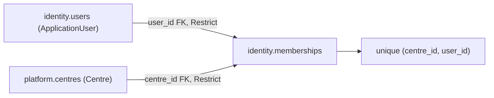

# src/TutoringCentre.Infrastructure/Persistence/Configurations/Identity/MembershipConfiguration.cs

## Purpose

Maps `Membership` to `identity.memberships` with the first foreign keys, composite unique index, converters and CHECK constraints in the schema.

## Where It Fits

Infrastructure/Persistence/Configurations/Identity, `internal`. Applied by `AppDbContext`. Mirrors the migration `AddIdentityAndMemberships`.

## Walkthrough

`ToTable("memberships", Schemas.Identity, ...)` with CHECKs `ck_memberships_role` (`role IN ('owner','teacher','secretary')`) and `ck_memberships_status` (`status IN ('active','inactive')`) (20-27). `HasKey(Id)` + `ValueGeneratedNever()` (29-30). `UserId` required with `HasOne<ApplicationUser>().WithMany().HasForeignKey(UserId).OnDelete(Restrict)` and index `ix_memberships_user_id` (32-38). `CentreId` required with `HasOne<Centre>().WithMany().HasForeignKey(CentreId).OnDelete(Restrict)` (40-45) - a foreign key **across schemas** (`identity` -> `platform`). `Role` and `Status` stored as lowercase text via `ValueConverter` (`RoleToDatabase/FromDatabase`, `StatusToDatabase/FromDatabase`, 72-100, each throwing `ArgumentOutOfRangeException` for unknown values), max length 20 / 10. Unique composite index `ux_memberships_centre_user` on `(CentreId, UserId)` (63-65). Shadow `CreatedAt`/`UpdatedAt` for `TimestampInterceptor` (68-69).

## Concepts Used

### ORM and EF Core

#### What it means

An ORM maps database rows to objects. EF Core keeps a *change tracker* that records the state of each entity (`Added`, `Unchanged`, `Modified`, `Deleted`); `SaveChanges` turns those states into `INSERT/UPDATE/DELETE`. LINQ expressions are translated to SQL by the provider and executed when awaited or enumerated (deferred execution). Mapping is declared in *model configuration*.

(Full tutorial with execution traces: [PROJECT_OVERVIEW2.md#69-ef-core-how-the-orm-actually-works-here](../../../../../../PROJECT_OVERVIEW2.md#69-ef-core-how-the-orm-actually-works-here).)

#### Where it appears in this file

Relationships.

#### How it works here

`HasOne<...>().WithMany().HasForeignKey(...)`.

#### Why it matters here

The schema's first foreign keys (no navigation properties on the entity - the Domain stays clean).

### Identity and membership modelling

#### What it means

*Identity* is the part of a system that stores users, credentials and lockout state. *Membership* models which user may act in which centre in which role. Keeping role on the membership (not on the user) lets one person be an owner in one centre and a teacher in another.

(Full tutorial with execution traces: [PROJECT_OVERVIEW2.md#628-identity-and-membership-modelling](../../../../../../PROJECT_OVERVIEW2.md#628-identity-and-membership-modelling).)

#### Where it appears in this file

Role and status per membership.

#### How it works here

Converters + CHECKs.

#### Why it matters here

Same three-tier validation as the locale on `Centre`.

### Concurrency, TOCTOU and unique indexes

#### What it means

TOCTOU (time of check to time of use): code checks a condition then acts, but another request can change the condition in between. Only the database can make "no two rows share a slug" true, via a unique index; application checks just produce friendlier errors in the common case.

(Full tutorial with execution traces: [PROJECT_OVERVIEW2.md#610-concurrency-the-slug-race-and-why-the-unique-index-is-the-real-guarantee](../../../../../../PROJECT_OVERVIEW2.md#610-concurrency-the-slug-race-and-why-the-unique-index-is-the-real-guarantee).)

#### Where it appears in this file

Unique (centre, user).

#### How it works here

Line 63.

#### Why it matters here

A user cannot hold two memberships in one centre even under concurrency (`MembershipConstraintTests`).

## Data and Control Flow

## Configuration and Environment

None. The file reads no environment variables and declares no configuration keys, URLs, ports or credentials.

## Gotchas and Issues

`OnDelete(Restrict)` means deleting a centre or user that has memberships is rejected by PostgreSQL (SQLSTATE 23503; proven by `MembershipConstraintTests.Delete_CentreWithAMembership_IsRejected`).

## Related Files

- [`src/TutoringCentre.Domain/Identity/Membership.cs`](../../../../TutoringCentre.Domain/Identity/Membership.cs.md)
- [`src/TutoringCentre.Infrastructure/Persistence/Configurations/Centres/CentreConfiguration.cs`](../Centres/CentreConfiguration.cs.md)
- [`src/TutoringCentre.Infrastructure/Persistence/Migrations/20261004112858_AddIdentityAndMemberships.cs`](../../Migrations/20261004112858_AddIdentityAndMemberships.cs.md)
- [`tests/TutoringCentre.Infrastructure.Tests/Identity/MembershipConstraintTests.cs`](../../../../../tests/TutoringCentre.Infrastructure.Tests/Identity/MembershipConstraintTests.cs.md)
