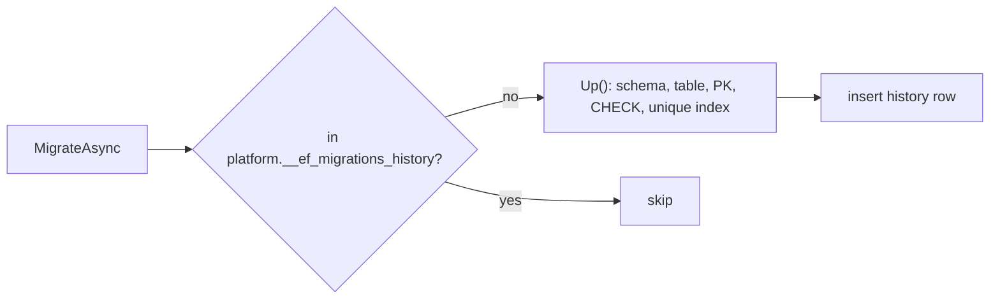

# src/TutoringCentre.Infrastructure/Persistence/Migrations/20261002222404_InitialPlatform.cs

## Purpose

The only migration: creates the `platform` schema, the `centres` table, its primary key, locale CHECK constraint and unique slug index.

## Where It Fits

Infrastructure/Persistence/Migrations (EF-generated, project-owned). Applied by `MigrationRunner`/`MigrateAsync`; verified by `MigrationTests`; paired with `...Designer.cs` and `AppDbContextModelSnapshot.cs`.

## Walkthrough

`Up` (11-): `EnsureSchema("platform")`; `CreateTable("centres", schema "platform")` with columns `id uuid`, `name varchar(120)`, `slug varchar(60)`, `time_zone_id varchar(64)`, `default_locale varchar(2)`, `created_at timestamptz` (all NOT NULL), `updated_at timestamptz` nullable; constraints `PrimaryKey("pk_centres", id)` and `CheckConstraint("ck_centres_default_locale", "default_locale IN ('ar','en')")`; `CreateIndex("ux_centres_slug", unique)` on `slug`.
`Down`: `DropTable("centres", "platform")` (does not drop the schema).
Name `20261002222404` is a UTC timestamp (2026-10-02 22:24:04); EF orders migrations by it. The file begins with a UTF-8 BOM.

## Concepts Used

### Database migrations

#### What it means

A migration is versioned code describing one schema change with an `Up` (apply) and `Down` (revert). EF records applied migrations in a history table and keeps a *model snapshot* of the last known model; the next `migrations add` diffs the current model against it.

(Full tutorial with execution traces: [PROJECT_OVERVIEW2.md#69-ef-core-how-the-orm-actually-works-here](../../../../../PROJECT_OVERVIEW2.md#69-ef-core-how-the-orm-actually-works-here).)

#### Where it appears in this file

This migration.

#### How it works here

`Up`/`Down`.

#### Why it matters here

Builds a brand-new environment from nothing (`MigrationTests`).

## Data and Control Flow

## Configuration and Environment

Connects through the DbContext's connection string. Creates objects in schema `platform`.

## Gotchas and Issues

Editing an applied migration does nothing on databases that already ran it; add a new migration instead.

## Related Files

- [`src/TutoringCentre.Infrastructure/Persistence/Configurations/Centres/CentreConfiguration.cs`](../Configurations/Centres/CentreConfiguration.cs.md)
- [`src/TutoringCentre.Infrastructure/Persistence/MigrationRunner.cs`](../MigrationRunner.cs.md)
- [`tests/TutoringCentre.Infrastructure.Tests/Persistence/MigrationTests.cs`](../../../../tests/TutoringCentre.Infrastructure.Tests/Persistence/MigrationTests.cs.md)
