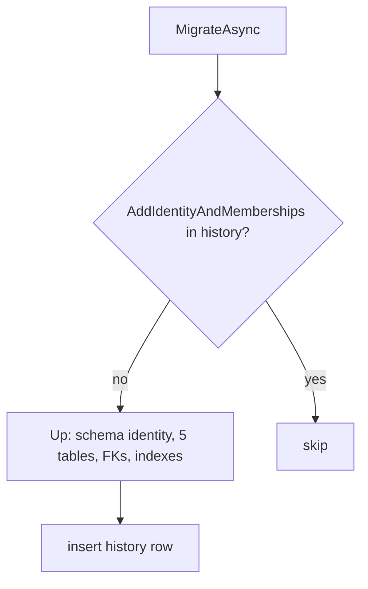

# src/TutoringCentre.Infrastructure/Persistence/Migrations/20261004112858_AddIdentityAndMemberships.cs

## Purpose

The second migration: creates the `identity` schema with `users`, `memberships`, `user_claims`, `user_logins` and `user_tokens`, their keys, foreign keys, indexes and CHECK constraints.

## Where It Fits

Infrastructure/Persistence/Migrations (EF-generated). Applied by `MigrationRunner`; verified by `MembershipConstraintTests` and `SystemInfoQueryTests`; paired with a Designer file and the model snapshot (both generated, not explained separately).

## Walkthrough

`Up` (13-187): `EnsureSchema("identity")` (15). **`users`** (18-46): `id uuid`, `display_name varchar(120)`, `preferred_locale varchar(2)`, `must_change_password boolean`, then Identity's columns (`user_name`, `normalized_user_name`, `email varchar(256)`, `normalized_email`, `email_confirmed`, `password_hash text`, `security_stamp text`, `concurrency_stamp`, `phone_number`..., `lockout_end timestamptz`, `lockout_enabled`, `access_failed_count int`); PK `pk_users`; CHECK `ck_users_preferred_locale`. **`memberships`** (48-80): `id`, `user_id`, `centre_id`, `role varchar(20)`, `status varchar(10)`, `created_at`, `updated_at`; PK; CHECKs `ck_memberships_role`/`_status`; FKs `fk_memberships_centres_centre_id` (-> `platform.centres`) and `fk_memberships_users_user_id`, both `ReferentialAction.Restrict`. **`user_claims`** (identity column `id`, FK cascade), **`user_logins`** (composite PK `(login_provider, provider_key)`), **`user_tokens`** (composite PK `(user_id, login_provider, name)`). Indexes (149-186): `ix_memberships_user_id`, `ux_memberships_centre_user` (unique, composite), `ix_user_claims_user_id`, `ix_user_logins_user_id`, `UserNameIndex` (unique, Identity default name), `ux_users_normalized_email` (unique).
`Down` (190-211): drops the five tables (not the schema). Timestamp id `20261004112858` = 2026-10-04 11:28:58 UTC. `.editorconfig` disables CA1861 for this folder because generated composite-column array literals trip the analyzer.

## Concepts Used

### Database migrations

#### What it means

A migration is versioned code describing one schema change with an `Up` (apply) and `Down` (revert). EF records applied migrations in a history table and keeps a *model snapshot* of the last known model; the next `migrations add` diffs the current model against it.

(Full tutorial with execution traces: [PROJECT_OVERVIEW2.md#69-ef-core-how-the-orm-actually-works-here](../../../../../PROJECT_OVERVIEW2.md#69-ef-core-how-the-orm-actually-works-here).)

#### Where it appears in this file

Second migration.

#### How it works here

Whole file.

#### Why it matters here

Adds the identity tables to an existing database without touching `platform.centres`.

### ORM and EF Core

#### What it means

An ORM maps database rows to objects. EF Core keeps a *change tracker* that records the state of each entity (`Added`, `Unchanged`, `Modified`, `Deleted`); `SaveChanges` turns those states into `INSERT/UPDATE/DELETE`. LINQ expressions are translated to SQL by the provider and executed when awaited or enumerated (deferred execution). Mapping is declared in *model configuration*.

(Full tutorial with execution traces: [PROJECT_OVERVIEW2.md#69-ef-core-how-the-orm-actually-works-here](../../../../../PROJECT_OVERVIEW2.md#69-ef-core-how-the-orm-actually-works-here).)

#### Where it appears in this file

Generated from configuration.

#### How it works here

Mirrors `ApplicationUserConfiguration`, `MembershipConfiguration`, Identity base model.

#### Why it matters here

CI would fail if the model changed without a new migration.

## Data and Control Flow

## Configuration and Environment

Creates objects in schema `identity` and foreign keys into `platform.centres`.

## Gotchas and Issues

Inherited Identity columns include some the app never uses (`phone_number`, `two_factor_enabled`, `lockout_enabled`...). `password_hash` stores Identity's hashed password; no plaintext password column exists.

## Related Files

- [`src/TutoringCentre.Infrastructure/Persistence/Configurations/Identity/MembershipConfiguration.cs`](../Configurations/Identity/MembershipConfiguration.cs.md)
- [`src/TutoringCentre.Infrastructure/Persistence/Configurations/Identity/ApplicationUserConfiguration.cs`](../Configurations/Identity/ApplicationUserConfiguration.cs.md)
- [`src/TutoringCentre.Infrastructure/Persistence/Migrations/20261002222404_InitialPlatform.cs`](20261002222404_InitialPlatform.cs.md)
- [`.editorconfig`](../../../../.editorconfig.md)
