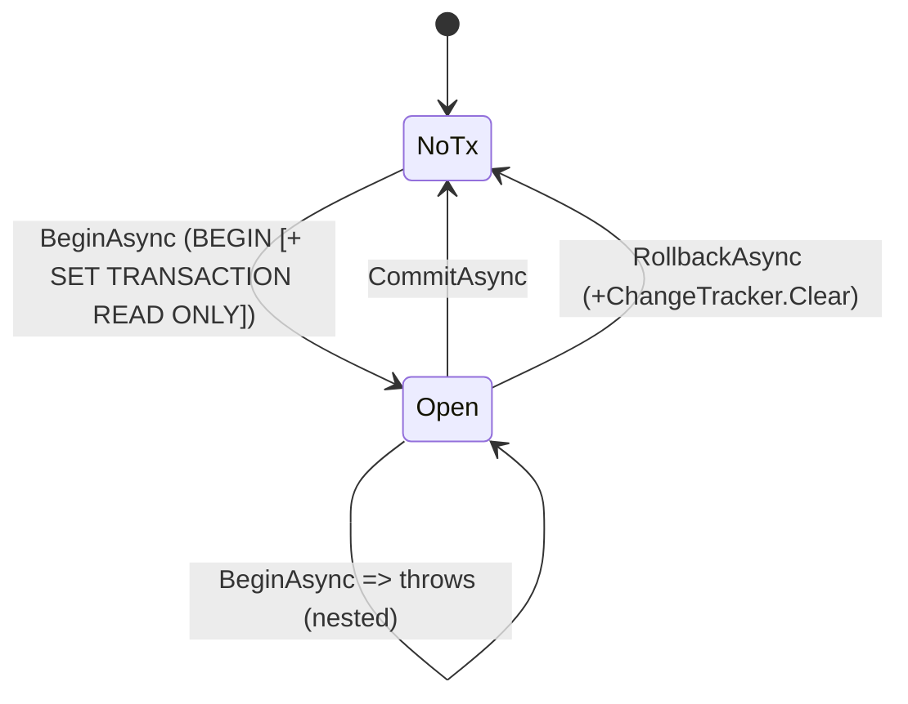

# src/TutoringCentre.Infrastructure/Persistence/UnitOfWork.cs

## Purpose

Implements the `IUnitOfWork` port with an explicit database transaction on the scoped `AppDbContext`, including PostgreSQL read-only transactions for queries.

## Where It Fits

Infrastructure/Persistence, `internal`, scoped. Called only by `Dispatcher`. Depends on `AppDbContext`.

## Walkthrough

Fields: `_db`, `_transaction` (nullable).
- `BeginAsync(readOnly, ct)` (22-45): if a transaction exists -> `InvalidOperationException("Nested units of work are not supported")` (27). `_transaction = await _db.Database.BeginTransactionAsync(ct)`. If `readOnly`: `ExecuteSqlRawAsync("SET TRANSACTION READ ONLY")` (37) - must be the first statement; PostgreSQL rejects writes (SQLSTATE 25006); on failure the catch rolls back and rethrows.
- `SaveChangesAsync` (47): `_db.SaveChangesAsync(ct)` - runs inside the open transaction; the `TimestampInterceptor` fires here.
- `CommitAsync` (49-61): throws if no transaction; commits; `finally` disposes and nulls it.
- `RollbackAsync` (63-80): no-op when none; clears `_transaction` first; rolls back; `finally` disposes and `_db.ChangeTracker.Clear()` (79) so nothing half-built remains.
Why not just rely on `SaveChanges`' implicit transaction: the transaction must also cover handler reads (row locks, planned tenant setting).

## Concepts Used

### Unit of Work and transactions

#### What it means

A *transaction* makes several database operations all-or-nothing and isolated from concurrent work. A *unit of work* groups the changes of one business operation and commits them together. EF Core's `DbContext` already tracks changes and is a unit of work; the repository adds a small port so the dispatcher can control the transaction without referencing EF.

(Full tutorial with execution traces: [PROJECT_OVERVIEW2.md#67-unit-of-work-and-transactions](../../../../PROJECT_OVERVIEW2.md#67-unit-of-work-and-transactions).)

#### Where it appears in this file

The class.

#### How it works here

Whole file.

#### Why it matters here

Transaction control behind a port.

### ORM and EF Core

#### What it means

An ORM maps database rows to objects. EF Core keeps a *change tracker* that records the state of each entity (`Added`, `Unchanged`, `Modified`, `Deleted`); `SaveChanges` turns those states into `INSERT/UPDATE/DELETE`. LINQ expressions are translated to SQL by the provider and executed when awaited or enumerated (deferred execution). Mapping is declared in *model configuration*.

(Full tutorial with execution traces: [PROJECT_OVERVIEW2.md#69-ef-core-how-the-orm-actually-works-here](../../../../PROJECT_OVERVIEW2.md#69-ef-core-how-the-orm-actually-works-here).)

#### Where it appears in this file

Explicit transaction + change tracker.

#### How it works here

`BeginTransactionAsync`, `ChangeTracker.Clear()`.

#### Why it matters here

`SaveChanges` joins the explicit transaction; clearing prevents stale tracked entities.

### async/await and cancellation

#### What it means

`async`/`await` lets a method wait for I/O (database, network) without blocking a thread: the method returns a `Task`, and execution resumes after the awaited operation completes. A `CancellationToken` is a cooperative signal (for example, the HTTP request was aborted) passed down so work can stop early.

(Full tutorial with execution traces: [PROJECT_OVERVIEW2.md#63-cqrs-and-the-hand-written-dispatcher](../../../../PROJECT_OVERVIEW2.md#63-cqrs-and-the-hand-written-dispatcher).)

#### Where it appears in this file

All members async.

#### How it works here

Task-returning methods.

#### Why it matters here

Network round trips to PostgreSQL.

## Data and Control Flow

## Configuration and Environment

None. The file reads no environment variables and declares no configuration keys, URLs, ports or credentials.

## Gotchas and Issues

A read-only query transaction that is committed without a save is intentional. Changing the order so another SQL statement runs before `SET TRANSACTION READ ONLY` would make PostgreSQL reject it.

## Related Files

- [`src/TutoringCentre.Application/Common/Ports/IUnitOfWork.cs`](../../TutoringCentre.Application/Common/Ports/IUnitOfWork.cs.md)
- [`src/TutoringCentre.Application/Common/Cqrs/Dispatcher.cs`](../../TutoringCentre.Application/Common/Cqrs/Dispatcher.cs.md)
- [`src/TutoringCentre.Infrastructure/Persistence/AppDbContext.cs`](AppDbContext.cs.md)
- [`tests/TutoringCentre.Infrastructure.Tests/Persistence/TransactionBoundaryTests.cs`](../../../tests/TutoringCentre.Infrastructure.Tests/Persistence/TransactionBoundaryTests.cs.md)
- [`tests/TutoringCentre.Infrastructure.Tests/Persistence/ReadOnlyQueryTests.cs`](../../../tests/TutoringCentre.Infrastructure.Tests/Persistence/ReadOnlyQueryTests.cs.md)
