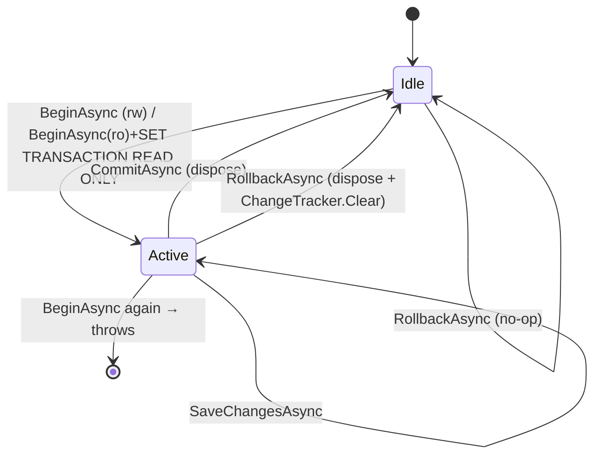

# src/TutoringCentre.Infrastructure/Persistence/UnitOfWork.cs

## Purpose
EF Core implementation of the `IUnitOfWork` port. EF's `DbContext` already tracks changes; this class only makes the **database transaction explicit**, so the Dispatcher can control it without referencing EF (lines 7–10).

## Where it fits
Infrastructure/Persistence, `internal sealed`. Registered scoped as `IUnitOfWork` (`DependencyInjection.cs:56`). It depends on `AppDbContext`, and `Dispatcher` is its only caller.

## Walkthrough
- **Lines 13–14:** fields `_db` and `IDbContextTransaction? _transaction`.
- **Lines 16–20:** the constructor null-guards.
- **Lines 22–45, `BeginAsync(readOnly, ct)`:**
  1. If a transaction already exists, throw `InvalidOperationException("Nested units of work are not supported")`. The comment says handlers must not dispatch other commands: one scope, one transaction.
  2. `_transaction = await _db.Database.BeginTransactionAsync(ct)`.
  3. If `readOnly`, run `ExecuteSqlRawAsync("SET TRANSACTION READ ONLY")`. It must be the first statement in the transaction; PostgreSQL then rejects writes with SQLSTATE 25006. If this fails, roll back with `CancellationToken.None` and rethrow.
- **Line 47:** `SaveChangesAsync` delegates to `_db.SaveChangesAsync(ct)`, which triggers `TimestampInterceptor`.
- **Lines 49–61, `CommitAsync`:** throws if there's no transaction. Otherwise it calls `CommitAsync`, and in `finally` disposes the transaction and sets `_transaction = null`.
- **Lines 63–81, `RollbackAsync`:**
  - If there's no transaction, return. That makes it **idempotent** and safe to call from the Dispatcher's `catch`.
  - It nulls the field *before* rolling back, so a throwing rollback doesn't leave a stale reference.
  - In `finally` it disposes and calls `_db.ChangeTracker.Clear()`, so "nothing half-built lingers in the scope".

## Concepts used
- **Explicit transactions in EF Core** (`Database.BeginTransactionAsync`).
- **PostgreSQL read-only transactions** for defence in depth on queries.
- **Idempotent cleanup** and `try/finally` disposal.
- **Change-tracker reset** after a failure.

## Data and control flow

## Configuration and environment
None directly. It needs a configured connection string at runtime: with a blank one, `BeginAsync` throws `InvalidOperationException` (verified).

## Gotchas and issues
- **A failed commit leaves tracked entities behind.** If `CommitAsync` throws, `_transaction` is nulled in `finally`, so the Dispatcher's follow-up `RollbackAsync` is a no-op and the change tracker is **not** cleared.
- **No connection-resiliency strategy** (`EnableRetryOnFailure`). If one is added later, user-initiated transactions like these need `CreateExecutionStrategy` wrapping. That's an EF Core rule, not repo code.
- **Untested.** No integration test proves the read-only behaviour against a real PostgreSQL.

## Related files
- [IUnitOfWork.cs](../../TutoringCentre.Application/Common/Ports/IUnitOfWork.cs.md)
- [Dispatcher.cs](../../TutoringCentre.Application/Common/Cqrs/Dispatcher.cs.md)
- [AppDbContext.cs](AppDbContext.cs.md)
- [TimestampInterceptor.cs](Interceptors/TimestampInterceptor.cs.md)
