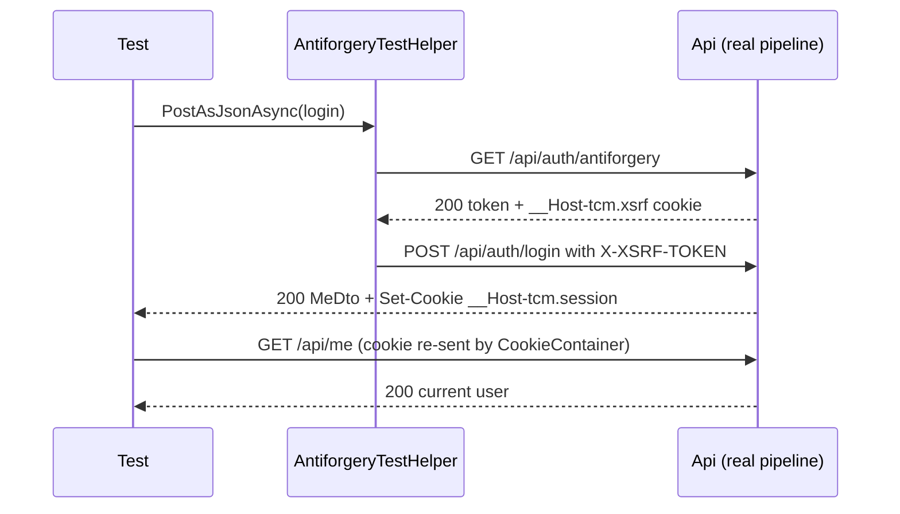

# tests/TutoringCentre.Api.Tests/Auth/LoginFlowTests.cs

## Purpose

HTTP-level tests of the happy paths of authentication: login, automatic and manual centre selection, re-login while signed in, logout and the session after logout.

## Where It Fits

Api.Tests/Auth; collection `api` (`ApiCollection`), so it uses the plain `ApiFactory` with a real PostgreSQL container. Calls the real endpoints in `AuthEndpoints.cs` through the real middleware pipeline, with the real CSRF protection (via `AntiforgeryTestHelper`).

## Walkthrough

`LoginFlowTests` (10-187). `InitializeAsync` (18-22): `factory.ResetAsync()` then `SeedCommand.RunAsync(factory.Services)` must return 0 - every test starts from the freshly seeded staff set (owner@nile.test, teacher@both.test, ...). `CreateSessionClient` (160-161) builds a client with `BaseAddress = https://localhost`; the comment explains why: the cookie has `CookieSecurePolicy.Always`, so the client's `CookieContainer` only re-sends it over https.

Tests:
- `Login_AsOwner_SetsHostPrefixedSecureCookieAndAutoSelectsTheirOnlyCentre` (26-47): login returns 200; exactly one `Set-Cookie` that starts with `__Host-tcm.session=` and contains `secure`, `httponly`, `samesite=lax`; body has `activeRole` `owner`, a non-empty `activeCentreId` and `memberships[0].centreSlug` `nile-centre` (a user with exactly one active membership is auto-selected).
- `Login_AsTeacherWithTwoCentres_LeavesNoActiveCentreSelected` (49-63): `activeCentreId` is JSON `null`, two memberships.
- `Login_WhileAlreadySignedIn_ReplacesTheSessionWithTheNewIdentity` (65-88): log in as owner, then log in again as the teacher on the same client; the second response shows the teacher's two memberships and `GET /api/me` then returns `teacher@both.test`. The comment explains the point: a request that already carries a valid cookie arrives authenticated (the actor is set by `ActorMiddleware`), so login must *replace* that actor (`CurrentActorContext.Reauthenticate`), not collide with it.
- `SelectCentre_ForAMembershipTheUserHolds_Returns204AndActivatesIt` (90-103): after selecting `maadi-hub`, `POST /api/session/centre` is 204 and `GET /api/me` reports that `activeCentreId` and role `teacher`.
- `SelectCentre_ForACentreTheUserDoesNotBelongTo_Returns403AndLeavesSessionUnchanged` (105-123): selecting `Guid.Empty` gives 403 with `code` `tenant.no_membership`, and `/api/me` still shows the previously selected centre.
- `Logout_Returns204AndClearsTheCookie` (125-139): 204; the single `Set-Cookie` starts with `__Host-tcm.session=;` (an expired/empty cookie).
- `GetMe_AfterLogout_Returns401` (141-157).

Helpers: `LoginAsTeacherAndGetMaadiHubCentreIdAsync` (163-180) logs in and scans `memberships` for `centreSlug == "maadi-hub"`; `ReadJsonAsync` parses the body with `JsonDocument` (so tests assert on the wire format, not on C# types).

## Concepts Used

### Cookie authentication and server-side sessions

#### What it means

After a successful login the server must remember *who* the browser is on later requests (HTTP itself is stateless). Cookie authentication does that with one cookie that the browser attaches automatically. Here the cookie holds an **encrypted, tamper-proof ticket** (the user's claims); only the server can read or create it, and flags such as `HttpOnly`, `Secure`, `SameSite` and the `__Host-` name prefix limit where and how browsers send it.

(Full tutorial with execution traces: [PROJECT_OVERVIEW2.md#624-cookie-authentication-and-server-side-sessions](../../../../PROJECT_OVERVIEW2.md#624-cookie-authentication-and-server-side-sessions).)

#### Where it appears in this file

Asserts on the `Set-Cookie` header and on behaviour after logout.

#### How it works here

The `Set-Cookie` header string is read and checked for name prefix and flags in `Login_AsOwner_SetsHostPrefixedSecureCookieAndAutoSelectsTheirOnlyCentre` and `Logout_Returns204AndClearsTheCookie`, and `GetMe_AfterLogout_Returns401` checks the effect; the https base address in `CreateSessionClient` is needed because of the Secure flag.

#### Why it matters here

These tests are the executable specification of the cookie contract documented in `docs/architecture/authentication.md`; if someone weakens a flag, they fail.

### Authorization by default, the actor pipeline and the tenant gate

#### What it means

A *fallback authorization policy* makes every endpoint require a signed-in user unless it explicitly opts out (fail closed). A single middleware translates the HTTP identity into the application's own `StaffActor`; the *tenant gate* is the one check that decides which centre a session may act in.

(Full tutorial with execution traces: [PROJECT_OVERVIEW2.md#629-authorization-by-default-the-actor-pipeline-and-the-tenant-gate](../../../../PROJECT_OVERVIEW2.md#629-authorization-by-default-the-actor-pipeline-and-the-tenant-gate).)

#### Where it appears in this file

Centre selection and the tenant gate.

#### How it works here

The two `SelectCentre_...` tests select a centre the user holds (204) and one they do not (403 `tenant.no_membership`).

#### Why it matters here

Shows that the *only* way to obtain an active centre is a live membership check, and that a refused selection does not modify the session.

### CSRF protection with antiforgery tokens

#### What it means

Because browsers attach cookies automatically, a malicious *other* site can make the victim's browser send a state-changing request. CSRF protection adds a second, explicit proof that the request came from the application's own script: a token that must be sent in a header, which a foreign site cannot read or set.

(Full tutorial with execution traces: [PROJECT_OVERVIEW2.md#625-csrf-protection-double-submit-antiforgery-tokens](../../../../PROJECT_OVERVIEW2.md#625-csrf-protection-double-submit-antiforgery-tokens).)

#### Where it appears in this file

Every POST goes through `AntiforgeryTestHelper`.

#### How it works here

Every POST in the file (login, select centre, logout) calls `AntiforgeryTestHelper.PostAsJsonAsync` or `PostAsync`, which first fetches a token from `/api/auth/antiforgery`.

#### Why it matters here

The tests never bypass CSRF; a regression in the protection would break *all* of them, not just the dedicated ones in `SecurityTests`.

### In-process hosting with WebApplicationFactory

#### What it means

`WebApplicationFactory<Program>` starts the real application inside the test process with an in-memory test server, so real middleware, DI and routing run without opening a network port. Tests can override configuration and services before the host is built.

(Full tutorial with execution traces: [PROJECT_OVERVIEW2.md#616-test-doubles-vs-real-database-tests](../../../../PROJECT_OVERVIEW2.md#616-test-doubles-vs-real-database-tests).)

#### Where it appears in this file

Real host, real database.

#### How it works here

Class header (lines 10-11) and `InitializeAsync` (18-22).

#### Why it matters here

Slow but exercises the actual wiring (cookie handler, middleware order, endpoint filters) that unit tests cannot.

### Testcontainers and Respawn

#### What it means

Testcontainers starts a disposable Docker container (here PostgreSQL 17) for the test run. Respawn deletes rows between tests, which is much faster than recreating the database.

(Full tutorial with execution traces: [PROJECT_OVERVIEW2.md#616-test-doubles-vs-real-database-tests](../../../../PROJECT_OVERVIEW2.md#616-test-doubles-vs-real-database-tests).)

#### Where it appears in this file

Reset between tests.

#### How it works here

`factory.ResetAsync()` (line 20).

#### Why it matters here

Each test starts from the same seeded database, so tests do not depend on each other.

## Data and Control Flow

## Configuration and Environment

Uses the seed password `ApiFactory.TestSeedPassword` (a throwaway test constant) and the seed data created by `SeedCommand` (`owner@nile.test`, `teacher@both.test`, centres `nile-centre`, `maadi-hub`). Needs Docker for the PostgreSQL container.

## Gotchas and Issues

No bugs or surprises found while reading this file.

## Related Files

- [`tests/TutoringCentre.Api.Tests/Fixtures/AntiforgeryTestHelper.cs`](../Fixtures/AntiforgeryTestHelper.cs.md)
- [`tests/TutoringCentre.Api.Tests/Fixtures/ApiFactory.cs`](../Fixtures/ApiFactory.cs.md)
- [`tests/TutoringCentre.Api.Tests/Auth/SecurityTests.cs`](SecurityTests.cs.md)
- [`src/TutoringCentre.Api/Auth/AuthEndpoints.cs`](../../../src/TutoringCentre.Api/Auth/AuthEndpoints.cs.md)
- [`src/TutoringCentre.Api/Cli/SeedCommand.cs`](../../../src/TutoringCentre.Api/Cli/SeedCommand.cs.md)
