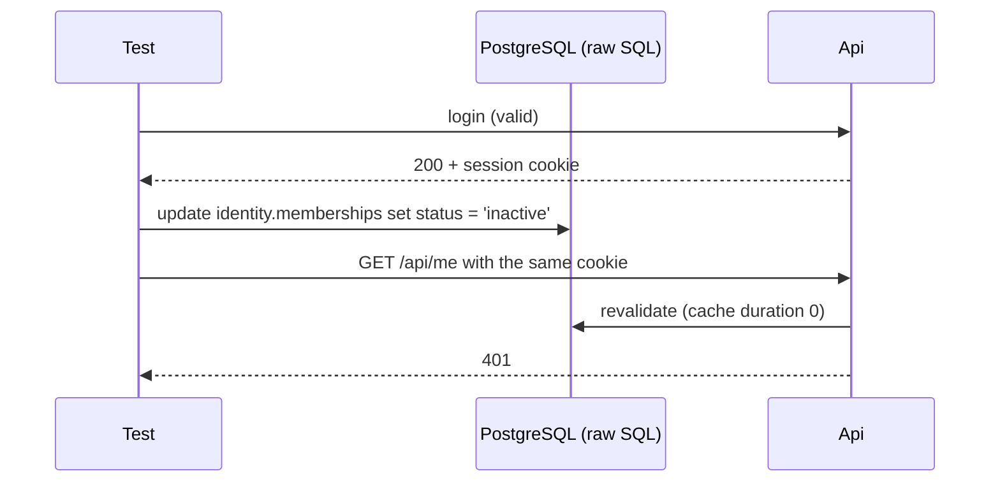

# tests/TutoringCentre.Api.Tests/Auth/SecurityTests.cs

## Purpose

Proves that the attacks the authentication design is meant to close are actually closed: user enumeration, CSRF, cookie tampering, stale and revoked sessions, tenant escalation, password spraying, lockout and forgotten authorization.

## Where It Fits

Api.Tests/Auth; collection `conventions` (`ConventionsCollection`), using `ConventionsFactory` instead of `ApiFactory` because two tests need its test-only endpoints (`/api/test/actor` and `/api/test-default-protection`).

## Walkthrough

Header comment (lines 10-15) and `InitializeAsync` (1: reset + seed). Two groups, labelled by the author's own task numbers in comments (`16.6: written by hand` at line 33, `16.7: AI-written` at line 99).

Tests, in file order:
- `Login_WrongPasswordForKnownUserAndUnknownUser_ReturnIdenticalResponses` (35-63): both return 401; the JSON field names are identical and every field value is identical except `traceId` and `correlationId`. This is the *enumeration resistance* test.
- `Logout_WithoutCsrfHeader_Returns403AndSessionStillWorksAfterwards` (65-84): a plain `client.PostAsync` without token -> 403 `auth.csrf_invalid`; `/api/me` still 200 (the refused request did not log the user out).
- `Login_WithoutCsrfHeader_Returns403` (86-97): login CSRF is also enforced.
- `Login_SetsAHostPrefixedSecureHttpOnlyLaxCookie` (101-114).
- `GetMe_WithNoCookie_Returns401` (116-124).
- `SelectCentre_ForACentreOwnerDoesNotBelongTo_Returns403AndMeStillShowsTheOriginalCentre` (126-145): looks up the `maadi-hub` id with `factory.ScalarAsync<Guid>("select id from platform.centres where slug = 'maadi-hub'")`.
- `RevokedMembership_NextRequestAfterRevocation_Returns401` (147-168): logs in as `secretary@nile.test`, `/api/me` 200, then runs raw SQL `update identity.memberships set status = 'inactive' ...` through `factory.ExecuteAsync`; the very next `/api/me` is 401. The comment at 165 states why it is deterministic: `SessionValidation:CacheDuration` is zero in tests (set in `ApiFactory`), so every request re-checks.
- `ChangedSecurityStamp_NextRequest_Returns401` (170-185): raw SQL overwrites `identity.users.security_stamp`; next request 401.
- `TamperedCookie_Returns401` (187-211): logs in on one client, takes the `name=value` pair from `Set-Cookie`, flips the last character (`FlipLastCharacter` (299-305)) and sends it from a second client created with `HandleCookies = false` so no `CookieContainer` merges the genuine cookie back in.
- `Login_11TimesWithinAMinuteFromOneClient_11thReturns429WithRetryAfter` (213-233): ten wrong-password logins with the same fixed partition string `security-suite-rate-limit` each return 401, the eleventh returns 429, `code` `auth.rate_limited` and a `Retry-After` header.
- `Login_FiveWrongPasswordsThenCorrect_StillReturns401WithTheOrdinaryFailureBody` (235-253): five wrong passwords for `teacher@both.test` (each with its own random partition so the rate limit is not involved), then the *correct* password still returns 401 `auth.invalid_credentials` - this is lockout, and its response is indistinguishable from a wrong password.
- `CurrentActor_AfterSelectingACentre_IsAStaffActorWithThatCentreInApplication` (255-284): after login and selection, `GET /api/test/actor` returns `kind` `Staff`, the selected `centreId` and role `teacher` - proving that the identity set by `ActorMiddleware` reaches Application code through `ICurrentActor`.
- `EndpointWithNoAuthorizationAttribute_Returns401ByDefault` (286-294): `/api/test-default-protection` (mapped with no auth metadata) answers 401 -> the fallback policy works.

## Concepts Used

### CSRF protection with antiforgery tokens

#### What it means

Because browsers attach cookies automatically, a malicious *other* site can make the victim's browser send a state-changing request. CSRF protection adds a second, explicit proof that the request came from the application's own script: a token that must be sent in a header, which a foreign site cannot read or set.

(Full tutorial with execution traces: [PROJECT_OVERVIEW2.md#625-csrf-protection-double-submit-antiforgery-tokens](../../../../PROJECT_OVERVIEW2.md#625-csrf-protection-double-submit-antiforgery-tokens).)

#### Where it appears in this file

Dedicated CSRF tests.

#### How it works here

`Logout_WithoutCsrfHeader_Returns403AndSessionStillWorksAfterwards` and `Login_WithoutCsrfHeader_Returns403` send POSTs without `X-XSRF-TOKEN` and expect 403 `auth.csrf_invalid`; all other POSTs use `AntiforgeryTestHelper`.

#### Why it matters here

Proves the endpoint filter really guards both an authenticated action (logout) and the anonymous one (login).

### Rate limiting, lockout and enumeration resistance

#### What it means

*Rate limiting* caps how many requests one source may make in a time window (stops password spraying from one place). *Lockout* temporarily blocks one account after repeated failures (stops many guesses against one account). *Enumeration resistance* means failure responses (and their timing) reveal nothing about whether an account exists.

(Full tutorial with execution traces: [PROJECT_OVERVIEW2.md#626-rate-limiting-lockout-and-enumeration-resistance](../../../../PROJECT_OVERVIEW2.md#626-rate-limiting-lockout-and-enumeration-resistance).)

#### Where it appears in this file

Rate limit, lockout and enumeration tests.

#### How it works here

`Login_WrongPasswordForKnownUserAndUnknownUser_ReturnIdenticalResponses`, `Login_11TimesWithinAMinuteFromOneClient_11thReturns429WithRetryAfter` and `Login_FiveWrongPasswordsThenCorrect_StillReturns401WithTheOrdinaryFailureBody`.

#### Why it matters here

Each defence has an observable symptom (429 + `Retry-After`; lockout indistinguishable from a wrong password; identical failure bodies), and the tests assert exactly those symptoms.

### Session revalidation and revocation

#### What it means

A self-contained cookie cannot be cancelled by itself. Revalidation re-checks the cookie's claims against the database on requests (here via a *security stamp* and the active membership), so a changed password or revoked access ends the session; a short cache bounds the database cost.

(Full tutorial with execution traces: [PROJECT_OVERVIEW2.md#627-session-revalidation-and-revocation](../../../../PROJECT_OVERVIEW2.md#627-session-revalidation-and-revocation).)

#### Where it appears in this file

Revocation and security stamp tests.

#### How it works here

`RevokedMembership_NextRequestAfterRevocation_Returns401` and `ChangedSecurityStamp_NextRequest_Returns401` change the database behind a live session and expect 401 on the next request.

#### Why it matters here

Shows that a cookie alone is not enough: the server re-checks membership and security stamp (cache disabled in tests).

### Cookie authentication and server-side sessions

#### What it means

After a successful login the server must remember *who* the browser is on later requests (HTTP itself is stateless). Cookie authentication does that with one cookie that the browser attaches automatically. Here the cookie holds an **encrypted, tamper-proof ticket** (the user's claims); only the server can read or create it, and flags such as `HttpOnly`, `Secure`, `SameSite` and the `__Host-` name prefix limit where and how browsers send it.

(Full tutorial with execution traces: [PROJECT_OVERVIEW2.md#624-cookie-authentication-and-server-side-sessions](../../../../PROJECT_OVERVIEW2.md#624-cookie-authentication-and-server-side-sessions).)

#### Where it appears in this file

Tampered cookie.

#### How it works here

`TamperedCookie_Returns401`.

#### Why it matters here

The ticket is encrypted and authenticated by Data Protection; a flipped character fails decryption, so the request is anonymous and the fallback policy answers 401.

### Authorization by default, the actor pipeline and the tenant gate

#### What it means

A *fallback authorization policy* makes every endpoint require a signed-in user unless it explicitly opts out (fail closed). A single middleware translates the HTTP identity into the application's own `StaffActor`; the *tenant gate* is the one check that decides which centre a session may act in.

(Full tutorial with execution traces: [PROJECT_OVERVIEW2.md#629-authorization-by-default-the-actor-pipeline-and-the-tenant-gate](../../../../PROJECT_OVERVIEW2.md#629-authorization-by-default-the-actor-pipeline-and-the-tenant-gate).)

#### Where it appears in this file

Default protection and actor propagation.

#### How it works here

`CurrentActor_AfterSelectingACentre_IsAStaffActorWithThatCentreInApplication` and `EndpointWithNoAuthorizationAttribute_Returns401ByDefault`.

#### Why it matters here

Both the fail-closed fallback policy and the actor pipeline are verified end to end.

### In-process hosting with WebApplicationFactory

#### What it means

`WebApplicationFactory<Program>` starts the real application inside the test process with an in-memory test server, so real middleware, DI and routing run without opening a network port. Tests can override configuration and services before the host is built.

(Full tutorial with execution traces: [PROJECT_OVERVIEW2.md#616-test-doubles-vs-real-database-tests](../../../../PROJECT_OVERVIEW2.md#616-test-doubles-vs-real-database-tests).)

#### Where it appears in this file

`ConventionsFactory` instead of `ApiFactory`.

#### How it works here

Class header (lines 16-17).

#### Why it matters here

Needs test-only endpoints; they are registered only in that factory, so they cannot leak into the product.

## Data and Control Flow

## Configuration and Environment

Relies on `SessionValidation:CacheDuration = 00:00:00`, `Seed:Password` and the `Testing` environment, all set in `ApiFactory.ConfigureWebHost`. The rate-limit partition header (`X-Test-RateLimit-Partition`) is honoured only when the host environment is `Testing` (see `LoginRateLimiting.cs`).

## Gotchas and Issues

The file comments refer to the author's own task numbers (16.6 hand-written, 16.7 AI-written); those numbers are not defined anywhere in the repository files I read other than as labels. Tests that change the database use raw SQL with literal emails; they are safe only because every test resets and reseeds first.

## Related Files

- [`tests/TutoringCentre.Api.Tests/Fixtures/AntiforgeryTestHelper.cs`](../Fixtures/AntiforgeryTestHelper.cs.md)
- [`tests/TutoringCentre.Api.Tests/Fixtures/ConventionsFactory.cs`](../Fixtures/ConventionsFactory.cs.md)
- [`tests/TutoringCentre.Api.Tests/Fixtures/ConventionEndpoints.cs`](../Fixtures/ConventionEndpoints.cs.md)
- [`tests/TutoringCentre.Api.Tests/Auth/LoginFlowTests.cs`](LoginFlowTests.cs.md)
- [`src/TutoringCentre.Api/Auth/LoginRateLimiting.cs`](../../../src/TutoringCentre.Api/Auth/LoginRateLimiting.cs.md)
- [`src/TutoringCentre.Api/Auth/SessionRevalidationHandler.cs`](../../../src/TutoringCentre.Api/Auth/SessionRevalidationHandler.cs.md)
- [`src/TutoringCentre.Api/Auth/AntiforgeryEndpointFilter.cs`](../../../src/TutoringCentre.Api/Auth/AntiforgeryEndpointFilter.cs.md)
