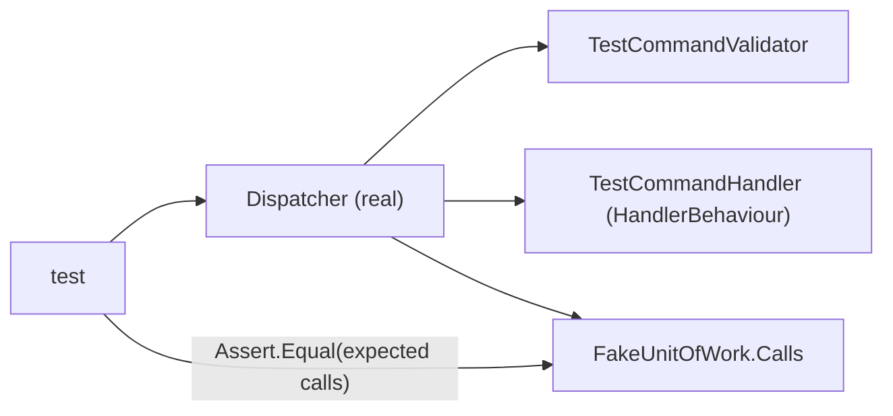

# tests/TutoringCentre.Application.Tests/Cqrs/DispatcherTests.cs

## Purpose

Tests every branch of the dispatcher pipeline using a call-recording fake unit of work.

## Where It Fits

Application.Tests/Cqrs. Tests `Application/Common/Cqrs/Dispatcher.cs`; implements cases C1-C9 of `docs/notes/pipeline-cases.md`. Uses `TestRequests.cs` and `FakeUnitOfWork`.

## Walkthrough

`CreateSut(mode)` builds a real `ServiceCollection` with singletons `FakeUnitOfWork` and `HandlerBehaviour`, scoped handlers and validators, calls `BuildServiceProvider()`, and constructs `new Dispatcher(provider, unitOfWork, NullLogger<Dispatcher>.Instance)`; a private `Fixture` implements `IDisposable` to dispose the provider. Tests (Arrange = `CreateSut`; Act = `SendAsync/QueryAsync`; Assert = result and `fixture.UnitOfWork.Calls`):
1. valid command -> `["Begin(rw)","Handle","Save","Commit"]` (C1).
2. invalid command -> failure `validation.failed`, kind Validation, `Fields` contains `name`, `Calls` empty (C2).
3. handler returns failure -> same error object, `["Begin(rw)","Handle","Rollback"]` (C3).
4. handler throws -> `InvalidOperationException` propagates, same calls (C4).
5. `ThrowOnSave` -> `["Begin(rw)","Handle","Save","Rollback"]` and no Commit (C5).
6. valid query -> `["Begin(ro)","Handle","Commit"]`, no `Save` (C6).
7. invalid query (C7); 8. query handler throws -> `["Begin(ro)","Handle","Rollback"]` (C8).
9. several failures -> keys `name`,`slug`; `name` has 2 messages; `slug` is `["Slug is too long."]` (C9).
Does not test: logging output, cancellation tokens, a missing handler registration, nested dispatch.

## Concepts Used

### CQRS and the dispatcher pipeline

#### What it means

CQRS separates *commands* (intent to change state) from *queries* (read-only questions). A *handler* executes exactly one command or query. A *dispatcher* is the single entry point that finds the handler and wraps shared steps (validation, transaction, logging) around it, so every use case behaves the same way regardless of who calls it (web endpoint, CLI, future bot).

(Full tutorial with execution traces: [PROJECT_OVERVIEW.md#63-cqrs-and-the-hand-written-dispatcher](../../../../PROJECT_OVERVIEW.md#63-cqrs-and-the-hand-written-dispatcher).)

#### Where it appears in this file

The pipeline under test.

#### How it works here

All tests.

#### Why it matters here

Locks the transaction semantics.

### Test doubles: fakes vs real dependencies

#### What it means

A *fake* is a small working substitute (in-memory repository). Real-dependency (integration) tests run actual components such as PostgreSQL. Fakes are fast and focused; integration tests prove behaviour only the real system provides.

(Full tutorial with execution traces: [PROJECT_OVERVIEW.md#616-test-doubles-vs-real-database-tests](../../../../PROJECT_OVERVIEW.md#616-test-doubles-vs-real-database-tests).)

#### Where it appears in this file

`FakeUnitOfWork` call log.

#### How it works here

Assertions on `Calls`.

#### Why it matters here

Pipeline order is verified without a database.

### Dependency Injection (DI) and the container

#### What it means

A class that needs a collaborator can create it itself (`new X()`), which hard-wires the choice, or it can *receive* it, usually as a constructor parameter. That second approach is dependency injection. A DI *container* stores *registrations* ("when asked for type A, build type B with lifetime L") and performs *resolution*: it picks a constructor, resolves each parameter recursively, builds the object and caches it according to the lifetime. This is inversion of control: the class no longer decides what it depends on.

(Full tutorial with execution traces: [PROJECT_OVERVIEW.md#62-dependency-injection-lifetimes-and-scanning](../../../../PROJECT_OVERVIEW.md#62-dependency-injection-lifetimes-and-scanning).)

#### Where it appears in this file

Building a real provider.

#### How it works here

`CreateSut`.

#### Why it matters here

Dispatcher resolves handlers/validators exactly as production does.

### xUnit mechanics (facts, theories, collections, fixtures)

#### What it means

`[Fact]` is a test; `[Theory]` + `[InlineData]` runs one test with several inputs. A *collection fixture* (`ICollectionFixture<T>` + `[Collection]`) shares one expensive object (a database container) across test classes and serialises them; `IAsyncLifetime` runs async setup/teardown.

(Full tutorial with execution traces: [PROJECT_OVERVIEW.md#616-test-doubles-vs-real-database-tests](../../../../PROJECT_OVERVIEW.md#616-test-doubles-vs-real-database-tests).)

#### Where it appears in this file

`Assert.ThrowsAsync`, `IDisposable` fixture.

#### How it works here

Tests 4, 5, 8.

#### Why it matters here

Asserting exceptions and cleanup.

## Data and Control Flow

## Configuration and Environment

None. The file reads no environment variables and declares no configuration keys, URLs, ports or credentials.

## Gotchas and Issues

Relies on exact call-name strings shared with `FakeUnitOfWork`.

## Related Files

- [`src/TutoringCentre.Application/Common/Cqrs/Dispatcher.cs`](../../../src/TutoringCentre.Application/Common/Cqrs/Dispatcher.cs.md)
- [`tests/TutoringCentre.Application.Tests/Cqrs/TestRequests.cs`](TestRequests.cs.md)
- [`tests/TutoringCentre.Application.Tests/Fakes/FakeUnitOfWork.cs`](../Fakes/FakeUnitOfWork.cs.md)
- [`docs/notes/pipeline-cases.md`](../../../docs/notes/pipeline-cases.md.md)
