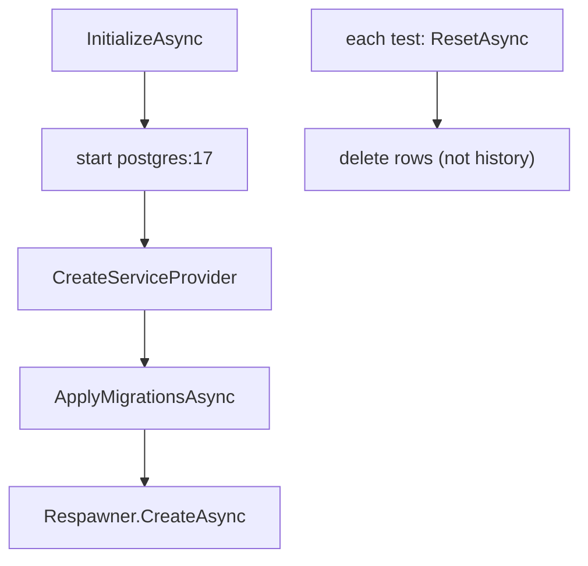

# tests/TutoringCentre.Infrastructure.Tests/Fixtures/PostgresFixture.cs

## Purpose

Shared test fixture: starts one PostgreSQL 17 container per test run, applies the real migrations, builds a production-identical DI container and resets data between tests with Respawn.

## Where It Fits

Infrastructure.Tests/Fixtures. Used through `PostgresCollection` by every database test. Depends on `AddApplication`, `AddInfrastructure`, `MigrationRunner`, Testcontainers, Respawn, Npgsql.

## Walkthrough

- `_container = new PostgreSqlBuilder("postgres:17").Build()`; `Services` (a `ServiceProvider`), `ConnectionString => _container.GetConnectionString()`.
- `InitializeAsync` (xUnit `IAsyncLifetime`): `StartAsync` container; `Services = CreateServiceProvider()`; `Services.ApplyMigrationsAsync()` (real migrations); opens an `NpgsqlConnection` and creates a `Respawner` with `DbAdapter.Postgres`, `SchemasToInclude = ["platform","identity"]`, `TablesToIgnore = [platform.__ef_migrations_history]` (so history survives resets).
- `CreateServiceProvider(configure?)`: in-memory configuration `ConnectionStrings:Postgres`; `new ServiceCollection().AddLogging().AddApplication().AddInfrastructure(configuration)`; optional extra registrations (test handlers); `BuildServiceProvider(new ServiceProviderOptions { ValidateOnBuild = true, ValidateScopes = true })`.
- `ResetAsync` (Respawn), `ScalarAsync<T>(sql)` (open connection, `ExecuteScalarAsync`), `CountCentresAsync`.
- `DisposeAsync`: dispose services and container.
Doc: the container's connection string is the only one ever used - never the development database.

## Concepts Used

### Testcontainers and Respawn

#### What it means

Testcontainers starts a disposable Docker container (here PostgreSQL 17) for the test run. Respawn deletes rows between tests, which is much faster than recreating the database.

(Full tutorial with execution traces: [PROJECT_OVERVIEW2.md#616-test-doubles-vs-real-database-tests](../../../../PROJECT_OVERVIEW2.md#616-test-doubles-vs-real-database-tests).)

#### Where it appears in this file

Container + Respawn.

#### How it works here

Fields and `InitializeAsync`.

#### Why it matters here

Real PostgreSQL semantics with fast cleanup.

### Dependency Injection (DI) and the container

#### What it means

A class that needs a collaborator can create it itself (`new X()`), which hard-wires the choice, or it can *receive* it, usually as a constructor parameter. That second approach is dependency injection. A DI *container* stores *registrations* ("when asked for type A, build type B with lifetime L") and performs *resolution*: it picks a constructor, resolves each parameter recursively, builds the object and caches it according to the lifetime. This is inversion of control: the class no longer decides what it depends on.

(Full tutorial with execution traces: [PROJECT_OVERVIEW2.md#62-dependency-injection-lifetimes-and-scanning](../../../../PROJECT_OVERVIEW2.md#62-dependency-injection-lifetimes-and-scanning).)

#### Where it appears in this file

Production-identical container.

#### How it works here

`CreateServiceProvider`.

#### Why it matters here

Tests exercise the same registrations as `Program.cs`.

### xUnit mechanics (facts, theories, collections, fixtures)

#### What it means

`[Fact]` is a test; `[Theory]` + `[InlineData]` runs one test with several inputs. A *collection fixture* (`ICollectionFixture<T>` + `[Collection]`) shares one expensive object (a database container) across test classes and serialises them; `IAsyncLifetime` runs async setup/teardown.

(Full tutorial with execution traces: [PROJECT_OVERVIEW2.md#616-test-doubles-vs-real-database-tests](../../../../PROJECT_OVERVIEW2.md#616-test-doubles-vs-real-database-tests).)

#### Where it appears in this file

`IAsyncLifetime`.

#### How it works here

Class declaration.

#### Why it matters here

Async startup/teardown.

## Data and Control Flow

## Configuration and Environment

Connection string comes from the container (random port, generated credentials), supplied as in-memory `ConnectionStrings:Postgres`.

## Gotchas and Issues

Needs a running Docker daemon; first run pulls the image. `ValidateOnBuild` makes missing registrations fail here.

## Related Files

- [`tests/TutoringCentre.Infrastructure.Tests/Fixtures/PostgresCollection.cs`](PostgresCollection.cs.md)
- [`tests/TutoringCentre.Infrastructure.Tests/Fixtures/PostgresTestBase.cs`](PostgresTestBase.cs.md)
- [`tests/TutoringCentre.Infrastructure.Tests/Fixtures/DispatchExtensions.cs`](DispatchExtensions.cs.md)
- [`src/TutoringCentre.Infrastructure/Persistence/MigrationRunner.cs`](../../../src/TutoringCentre.Infrastructure/Persistence/MigrationRunner.cs.md)
