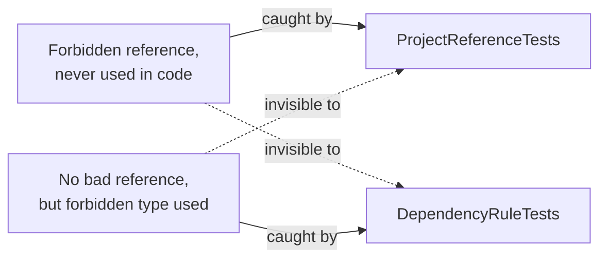

<!-- Generated by semantic-git. Do not edit manually -- regenerate with /semantic-git -->

# tests/ — Five Projects, One Per Layer Plus One for Architecture

Five test projects mirror the four `src/` projects one-to-one, plus a fifth dedicated to checking the architecture itself. Each test project references only the layer it tests (the Architecture project references all four, since its whole job is checking relationships *between* them).

| Test project | Tests | Currently contains |
| --- | --- | --- |
| `TutoringCentre.Domain.Tests` | Domain unit tests | Nothing yet — Domain has no logic |
| `TutoringCentre.Application.Tests` | Application unit tests | Nothing yet — Application has no logic |
| `TutoringCentre.Infrastructure.Tests` | Infrastructure/database/integration tests | Nothing yet |
| `TutoringCentre.Api.Tests` | HTTP-level behavior of the running API | `Health/HealthEndpointTests.cs` — 2 tests |
| `TutoringCentre.Architecture.Tests` | Dependency rules between all four layers | `DependencyRuleTests.cs` (3 tests) + `ProjectReferenceTests.cs` (4 tests) |

Running `dotnet test` from the repo root currently executes **9 tests total** (the first three projects report "no test is available," which is expected — they're empty shells waiting for Domain/Application logic to exist).

## TutoringCentre.Api.Tests — HTTP behavior

Uses `Microsoft.AspNetCore.Mvc.Testing`'s `WebApplicationFactory<Program>` to host the real `Program.cs` in-process (an in-memory `TestServer`, not a real Kestrel socket) and send real HTTP requests at it. This exercises the actual DI container, configuration, and middleware pipeline — not a mock of them.

**`Liveness_ReturnsOk`**: `GET /health` → expects `200`. No configuration override — proves liveness works with whatever `appsettings`/user-secrets happen to be present, and never depends on the database.

**`Readiness_WhenDatabaseUnreachable_Returns503`**: overrides `ConnectionStrings:Postgres` to `Host=127.0.0.1;Port=1;...;Timeout=2` (port 1 on loopback refuses connections immediately; `Timeout=2` keeps the test fast on systems that retry before refusing) via `WithWebHostBuilder(b => b.UseSetting(...))`, then asserts `GET /health/ready` → `503`.

**Why `UseSetting`, not `ConfigureAppConfiguration`**: `UseSetting` is visible to the host *before* `builder.Build()` runs, which matters because `AddInfrastructure` reads the connection string while services are being registered — i.e., before the app is built. A `ConfigureAppConfiguration` override isn't guaranteed to be visible that early, so it could silently fail to override anything and the test would pass for the wrong reason.

**How this was verified, not just asserted**: during development, the "unreachable" connection string was temporarily swapped for a real, reachable local database connection string, and the readiness test was confirmed to *fail* (actual `200`, not `503`) before being reverted. This proves the override genuinely reaches `AddInfrastructure` — a test that happened to pass because the override never took effect (and the "not configured" fallback answered 503 instead) would prove nothing.

## TutoringCentre.Architecture.Tests — fitness functions

Two independent techniques, because each sees a different kind of violation:

### DependencyRuleTests.cs (type-level, via NetArchTest.Rules)

Loads each layer's compiled assembly via its `AssemblyMarker` type and asserts `Types.InAssembly(assembly).ShouldNot().HaveDependencyOnAny(forbidden).GetResult().IsSuccessful`:

- **Domain** must not depend on: `TutoringCentre.Application`, `TutoringCentre.Infrastructure`, `TutoringCentre.Api`, `Microsoft.EntityFrameworkCore`, `Microsoft.AspNetCore`, `Npgsql`.
- **Application** must not depend on: `TutoringCentre.Infrastructure`, `TutoringCentre.Api`, `Microsoft.EntityFrameworkCore`, `Microsoft.AspNetCore`, `Npgsql`.
- **Infrastructure** must not depend on: `TutoringCentre.Api`.

Each assertion is preceded by `Assert.NotEmpty(types.GetTypes())` — a guard against accidentally scanning the wrong (or an empty) assembly, which would make the rule pass trivially without checking anything.

**What this catches**: a type whose compiled IL actually *references* a forbidden type — a field, a method call, a base class, anything NetArchTest can see by reading the assembly with Mono.Cecil. It does **not** catch a `ProjectReference` that's declared but never used, because the C# compiler drops unused assembly references from the compiled output entirely — there's nothing left in the IL to detect.

### ProjectReferenceTests.cs + ProjectFiles.cs (declared-reference level)

`ProjectFiles.ReadProjectReferences(projectName)` loads the named project's `.csproj` as XML, reads every `<ProjectReference Include="...">`, strips the path down to just the project name, and returns the sorted list. `ProjectReferenceTests` asserts each project's reference list exactly matches the allowed set from the architecture diagram:

- Domain → `[]` (nothing)
- Application → `["TutoringCentre.Domain"]`
- Infrastructure → `["TutoringCentre.Application", "TutoringCentre.Domain"]`
- Api → `["TutoringCentre.Application", "TutoringCentre.Infrastructure"]`

**What this catches**: a reference that exists in the `.csproj` but whose types are never used in code — exactly the case the type-level test above is blind to.

Walking up from `AppContext.BaseDirectory` to find `TutoringCentre.slnx` lets this test find the repo root without a hardcoded path, so it works identically on a developer's machine and in CI.

### Why two tests instead of one

A project reference and actual code usage are different facts about a project, and the compiler only preserves one of them (usage) in the output assembly. Checking only declared references would miss real violations where a reference happens to be unused-but-present; checking only compiled IL would miss a reference sitting in a `.csproj` that nobody has used *yet* but is one `using` statement away from a violation.

### How this was proven to actually work (not just written and trusted)

Three experiments, each reverted afterward:

1. **Added `Api → Domain` as a `ProjectReference`, used nowhere.** Result: `ProjectReferenceTests.Api_ReferencesOnlyApplicationAndInfrastructure` failed (actual list included `TutoringCentre.Domain`); all `DependencyRuleTests` still passed. Confirms only the declared-reference test sees an unused forbidden reference.
2. **Added a `FrameworkReference` to `Microsoft.AspNetCore.App` in Domain, plus a type using `Microsoft.AspNetCore.Http.HttpContext`.** Result: `DependencyRuleTests.Domain_DoesNotDependOnOtherLayersOrFrameworks` failed, naming the exact offending type; all four `ProjectReferenceTests` passed (no `ProjectReference` changed — a `FrameworkReference` isn't one). Confirms only the type-level test sees framework usage via a mechanism other than `ProjectReference`.
3. **Added `Domain → Infrastructure` as a `ProjectReference`** (which, combined with the existing `Infrastructure → Application → Domain` chain, creates a cycle). Result: `dotnet build`/`dotnet restore` failed immediately with `MSB4006: There is a circular dependency in the target dependency graph`, before any test even ran. Confirms that for these four projects specifically, every *reverse* reference is a project cycle the build toolchain already rejects — the two architecture tests exist to catch the violations the build allows (extra inward references, and framework/type usage), not reverse references.

## Shared test infrastructure

- **xUnit** everywhere, added via `dotnet new xunit` templates, then stripped of per-project `Version=` attributes (Central Package Management forbids them — versions live only in `../Directory.Packages.props`).
- **`.editorconfig`** scopes `dotnet_diagnostic.CA1707.severity = none` to `tests/**/*.cs` only — CA1707 flags underscores in identifiers, but xUnit's `Method_Condition_Result` naming convention needs them. Production code under `src/` keeps the rule at its default severity.
- **`InternalsVisibleTo`** — each of the four `src/` projects grants `TutoringCentre.Architecture.Tests` access to its `internal` `AssemblyMarker` type. This is neither a `ProjectReference` nor a `PackageReference`, so it doesn't violate "Domain references nothing" — it's purely a compiler-level visibility grant, one-directional from test to source.

## Important files

| File | Why it matters |
| --- | --- |
| `TutoringCentre.Api.Tests/Health/HealthEndpointTests.cs` | The only tests currently exercising real application behavior end-to-end |
| `TutoringCentre.Architecture.Tests/DependencyRuleTests.cs` | Type-level architecture enforcement |
| `TutoringCentre.Architecture.Tests/ProjectReferenceTests.cs` | Declared-reference architecture enforcement |
| `TutoringCentre.Architecture.Tests/ProjectFiles.cs` | Shared XML-reading helper the reference test depends on |

## Edge cases and gotchas

- **`CS0122 'Program' is inaccessible`** if `public partial class Program;` is missing from `Api/Program.cs` — `WebApplicationFactory<Program>` needs that type to be public.
- **`CS0122` on an `AssemblyMarker`** if a `src/` project is missing its `InternalsVisibleTo Include="TutoringCentre.Architecture.Tests"` entry.
- **Expected arrays in `ProjectReferenceTests` must stay in ordinal sort order** — `ProjectFiles.ReadProjectReferences` sorts with `StringComparer.Ordinal`, so an expected array typed in the wrong order would fail even when the actual references are correct.
- **Comparing by project name, not full path** — `ProjectFiles` strips each reference down to just the filename-without-extension specifically so the test behaves identically on Windows (backslash paths) and Linux CI (where a raw backslash is just a character, not a separator).
